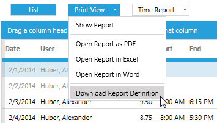
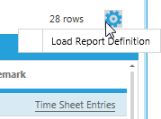
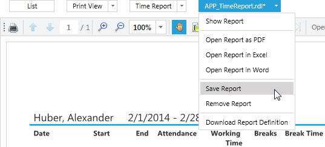
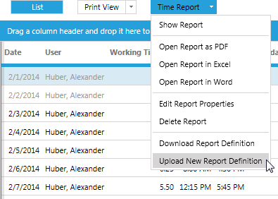

# Custom Reports

In addition to generated printable reports, custom reports can be added to a time cockpit list. The custom reports appears next to the standard **Print View** button. In the following chapter describes the workflow to integrate custom reports with your existing time cockpit lists.

> [!NOTE]
In this article, we would like to show you how to use the reporting features in time cockpit. However, the article does not explain how to build your own custom reports in [Microsoft SQL Server 2008 R2 Report Builder 3.0](http://www.microsoft.com/en-us/download/details.aspx?id=6116). You can find a detail description how to do that at [Building Custom Reports](https://www.timecockpit.com/blog/2014/02/27/Building-Custom-Reports-in-Time-Cockpit).

## Download Report Definition

The easiest way to start creating custom reports is to download the report definition from the **Print View** split button drop down menu. Click **Download Report Definition** to download the report definition that is generated for a standard **List View**.

From there, start changing the report to your likings. To edit an .rdl file using [Microsoft SQL Server 2008 R2 Report Builder 3.0](http://www.microsoft.com/en-us/download/details.aspx?id=6116) is recommended.

## Customize Report

How to use [Reporting Services (SSRS)](http://msdn.microsoft.com/de-de/library/ms159106.aspx) is not in the scope of this article. Please find detailed instructions on how to create custom report in this video: [Building Custom Reports](https://www.timecockpit.com/blog/2014/02/27/Building-Custom-Reports-in-Time-Cockpit). There you can also find an extensive slide deck on [Reporting Services (SSRS)](http://msdn.microsoft.com/de-de/library/ms159106.aspx) in general.

## Test Report

To test a custom report definition open the **cog** menu and click **Load Report Definition**. The custom report will be loaded in the embedded time cockpit report viewer. As data source time cockpit will use the result of the list that the report was attached to. If the filter of the list that the custom report was attached to is changed, the content of the report will be filled with the data according to the new filter criteria.

Now the report can be "debugged" visually. After a report has been loaded into time cockpit, it can still be edited in [Microsoft SQL Server 2008 R2 Report Builder 3.0](http://www.microsoft.com/en-us/download/details.aspx?id=6116). To view changes made in [Microsoft SQL Server 2008 R2 Report Builder 3.0](http://www.microsoft.com/en-us/download/details.aspx?id=6116) save the report definition and switch to time cockpit and hit **Refresh**. time cockpit will load the updated report definition and fill it time cockpit data.

## Upload Report

To upload a custom report to time cockpit click **Save Report** in the context menu of the pending report button (highlighted in blue).

Clicking Save Report will open a dialog. Set the a friendly name that will show up in the time cockpit UI.

Additionally, you can set advanced settings in the dialog:

- Is Visible Expression: Use a TCQL expression that determines when a custom report is visible. For details on TCQL expressions see Expression Language (TCQL).
- Sort Order: The sort order determines at which position your custom report is show.

> [!NOTE]
The position of the standard List view and the Print View are fixed. You can only define the position within your customer reports

Click **Save & Close** and the report will be permanently attached to a list. After synchronizing, the report will be available to all users in a time cockpit account.

## Update Report

To update a custom report, click **Download Report Definition** and proceed with the steps as described in [Customize Report](#customize-report). When finished altering a report, click **Upload New Report Definition**. This will replace the current report definition.

