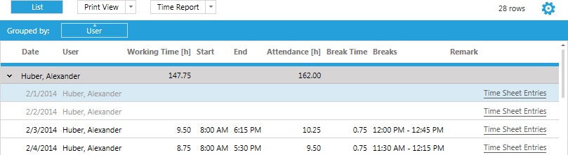
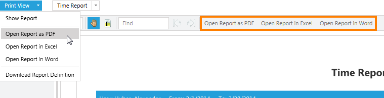

# Standard Print View

When you open a list from the menu, your data will be presented in the list view by default. There you can change various things on the fly. E.g. you can change the lists sorting, or its grouping to fit you current needs.

Every list offers a **Print View** option which renders a printable version of the list. The **Print View** reflects all the alterations made in the **List View**. If the sort order or the grouping was changed, the printable report will be sorted and grouped the way defined in the **List View**.

In the **Print View** various report parameters (**Report**, **Layout** and **Page Setup**) can be changed:

Option | Description
--- | ---
Title | Represents the title of the report.
Show Filter | Indicates whether to show the filter header on top of the report.
Font Family | Determines the font that is used in the whole report. In the Print View only one font can be used.
Font Size | Determines the font size that is used for the data rows and the header. The font size does not effect the font size of the title.
Wrap Mode | Auto Fit: Resizes the width of the columns along the widest text found in the first 500 rows. Wrap: If the text in a column exceeds a certain width the text is wrapped. Truncate: If the text in a column exceeds a certain width the text is truncated.
Color | Determines the color that is used for the header row and separators.
Orientation | Automatic: Determines the orientation according to the width of the data contained in the report. Portrait: Indicates that the report should be rendered in portrait mode. Landscape: Indicates that the report should be rendered in landscape mode.
Page Size | A set of predefined report formats.

Each report can be exported to various output formats, PDF, Excel or Word. To do so, you can use the drop down menu in the **Print View** split button, or the corresponding buttons in the report viewer menu.