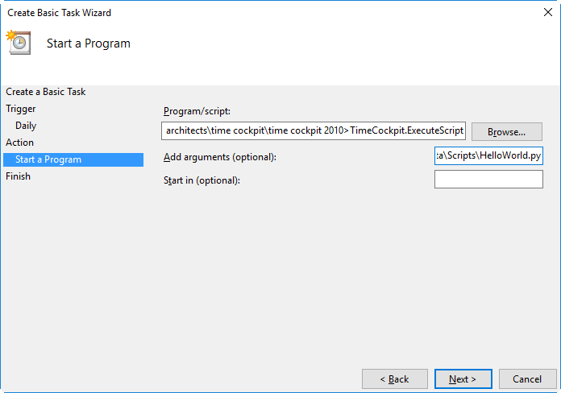

# Automating Scripts

To allow the non-interactive, scheduled execution of IronPython scripts time cockpit offers the ExecuteScript program. This topic describes the features, parameters and usage examples for automating script execution.

## Features of ExecuteScript

Besides its primary goal of executing IronPython scripts the utility allows to further parameterize its behavior. To allow integration into larger systems its return value indicates the success or failure of the attempted operation which can be used to chain command calls or use in other scripts via the `%ERRORLEVEL%` variable. The script output may be directly written into a provided file while considering different behaviors if the output file already exists. By default the script will be executed using the client data context but a flag enables the execution on the server data context. Another flag allows to wrap the whole script execution into a transaction which will be rolled back if an exception occurs during execution.

## Parameters

The following table describes the parameters supported by ExecuteScript. Most parameters offer interchangeable short and long forms. Either a script file name or an action name have to be provided. All other parameters are optional.

Parameter | Description
--- | ---
-f &lt;scriptFileName&gt;<br/>--file &lt;scriptFileName&gt; | Script file to execute.
--action &lt;actionName&gt; | Predefined time cockpit action to trigger.
-o &lt;scriptFileName&gt;<br/>--output &lt;scriptFileName&gt; | File to write script output to.
-O<br/>--overwrite | Overwrite output file if it exists.
-A<br/>--append | Append to output file if it exists.
-T<br/>--transaction | Execute the script within a transaction.
-s<br/>--server | Use the server data context instead of the client data context.
-q<br/>--quiet | Don't print any output.
--help | Display this help screen.

## Usage Example

The following example shows how to execute a very simple IronPython script from the command line using the server data context and a transaction:

```
C:\Program Files\software architects\time cockpit\time cockpit 2010>TimeCockpit.ExecuteScript -s -T -f C:\Data\Scripts\HelloWorld.py
Hello World
```

> [!NOTE]
The script output is printed on the standard output unless we add the quiet flag.

By using the Windows Task Scheduler a periodic task to automate the previously shown script execution can be configured. After creating a basic (or normal) task and setting the options for the time of execution we need to provide the location of the ExecuteScript program and its parameters.

