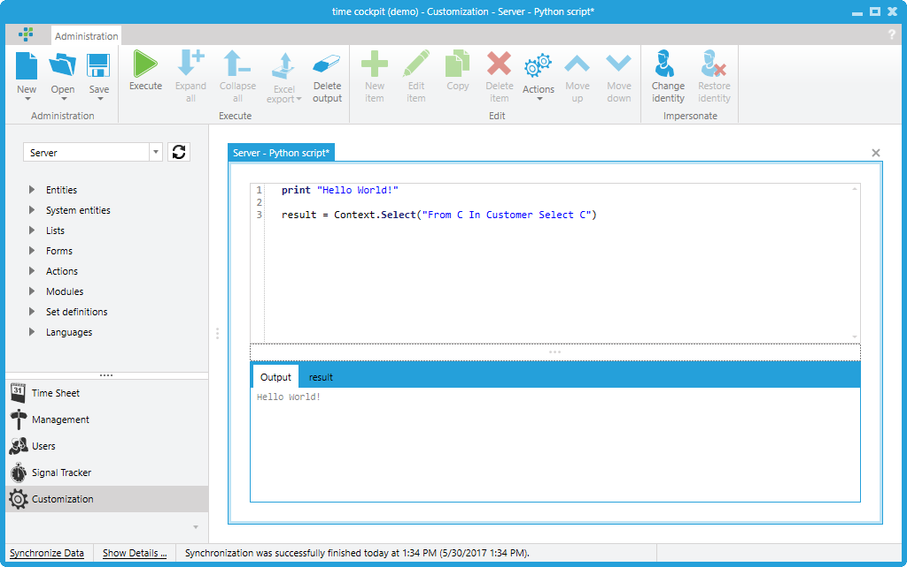

# Scripting

Time cockpit supports the use of [IronPython](http://ironpython.net/) to automate certain tasks in the system. Examples of such tasks include

- making changes to the data model,
- implementing interfaces (i.e. adding, updating and deleting of items in the database),
- making changes to the user interface (e.g. lists, forms),
- running batch processes (e.g. billing process at the end of the month),

In this chapter we describe how you can write, create and run IronPython scripts in the time cockpit system.

> [!NOTE]
If you want to write a stand alone program (e.g. an interface importing data from another system) that should not run inside time cockpit you can also use your favorite .NET programming language (e.g. C#). See chapter [HowTo: Use C# to Access time cockpit API](https://help.timecockpit.com/?topic=html/ff51bcbb-0ed3-425f-83aa-5094f5899a98.htm) for details.

## The Built-In Script Editor

To create a script for time cockpit you can use the built in script editor or any other editor of your choice (e.g. Microsoft Visual Studio). The built in script editor can be found in the Administration module. With the New button in the ribbon you can create a new script. You can save scripts in script files. IronPython script files have the extension `.py`.



You can execute scripts using the Execute button in the ribbon or the F5 key. If you select a part of the script only the selected part of the script is executed. In the lower part of the script editor you see the output of the script. If your script generates a tabular result you can assign the result to the python variable result. If result is an [IEnumerable](http://msdn.microsoft.com/en-us/library/9eekhta0(VS.100).aspx)<<xref:TimeCockpit.Data.EntityObject>> a result tab appears in which the content of the table is displayed.

## Basics For Time Cockpit Scripts

You can use all Python language constructs that are supported by IronPython. If you want to learn more about the language Python we recommend the [documentation web site for IronPython](http://ironpython.net/documentation/).

If you want to interact with the data access layer of time cockpit from within your script you have to use the <xref:TimeCockpit.Data.DataContext> class. The time cockpit script runtime creates an instance of this class for you and assigns it to the `Context` variable. The following sample scripts shows how to execute a [TCQL statement](~/doc/tcql/overview.md) and print the result:

```python
for proj in Context.Select("From P In Project Select P"):
  print proj.Code

print "Done!"
```

The previous sample uses the [Select(String)](xref:TimeCockpit.Data.DataContext#TimeCockpit_Data_DataContext_Select_System_String_TimeCockpit_Data_Database_SelectCache_) method to execute the query. If the query needs parameters you should use the [Select(String, IEnumerable<QueryParameter>)](xref:TimeCockpit.Data.DataContext#TimeCockpit_Data_DataContext_Select_TimeCockpit_Data_QueryLanguage_Syntax_Query_System_Collections_Generic_IEnumerable_TimeCockpit_Data_QueryLanguage_QueryParameter__TimeCockpit_Data_Database_SelectCache_) method instead. From scripts you can access this method using the [SelectWithParams](xref:TimeCockpit.Data.DataContext#TimeCockpit_Data_DataContext_SelectWithParameters_System_Collections_Generic_IEnumerable_System_Collections_Generic_KeyValuePair_System_Object_System_Object___) alias. You have to pass a dictionary as the only parameter to [SelectWithParams](xref:TimeCockpit.Data.DataContext#TimeCockpit_Data_DataContext_SelectWithParameters_System_Collections_Generic_IEnumerable_System_Collections_Generic_KeyValuePair_System_Object_System_Object___). The dictionary has to contain a member named `Query` whose value has to be the TCQL query. Add additional members to the dictionary for every parameter that is used inside the TCQL query. The following sample shows how the method can be used:

```python
for proj in Context.SelectWithParams({
  "Query": "From P In Project Where P.Code Like @ProjectCode Select P",
  "@ProjectCode": "%test%" }):
  print proj.Code

print "Done!"
```

If you want to select a single row from the database use the [SelectSingle(String)](xref:TimeCockpit.Data.DataContext#TimeCockpit_Data_DataContext_SelectSingleAsync_System_String_TimeCockpit_Data_Database_SelectCache_) or [SelectSingleWithParameters(String, IEnumerable<KeyValuePair<Object, Object>>)](xref:TimeCockpit.Data.DataContext#TimeCockpit_Data_DataContext_SelectSingleWithParameters_System_Collections_Generic_IEnumerable_System_Collections_Generic_KeyValuePair_System_Object_System_Object___) methods.

```python
# Usage of SelectSingle without parameters 
print Context.SelectSingle("From P In Project Where P.Code = 'Test neu' Select P").Code

# Usage of SelectSingle with parameters 
print Context.SelectSingleWithParams({
  "Query": "From P In Project Where P.Code = @ProjectCode Select P",
  "@ProjectCode": "Test neu"}).Code

print "Done!"
```

## Read and Modify Data Model

The data model of your time cockpit installation can be changed as you need it to. You can change the data model either in the user interface or inside scripts. To access the model in a script you can use the [Model](xref:TimeCockpit.Data.DataContext#TimeCockpit_Data_DataContext_Model) property.

The following sample script prints the names of all entity defined in the current model:

```python
for entity in Context.Model.Entities:
  print entity.Name

print "Done!"
```

The model returned by [Model](xref:TimeCockpit.Data.DataContext#TimeCockpit_Data_DataContext_Model) must not be changed. If you change anything in this model you will not be able to save your changes to the underlying database. If you need to have a writable model that can be saved use [GetWritableModel](xref:TimeCockpit.Data.DataContext#TimeCockpit_Data_DataContext_GetWritableModel) to retrieve the model.

> [!NOTE]
[GetWritableModel](xref:TimeCockpit.Data.DataContext#TimeCockpit_Data_DataContext_GetWritableModel) can only be called in a script that is running on a Server context because in a Client context the model can never be changed!

The following sample script adds a new entity to the underlying model. Note that the model that should be changed is retrieved using [GetWritableModel](xref:TimeCockpit.Data.DataContext#TimeCockpit_Data_DataContext_GetWritableModel). The change is saved using the [SaveModel](xref:TimeCockpit.Data.DataContext#TimeCockpit_Data_DataContext_SaveModel_TimeCockpit_Data_DataModel_Model_) method.

```python
model = Context.GetWritableModel()

if not model.Entities.Contains("MyNewEntity"):
  newEntity = ModelEntity()
  newEntity.Name = "MyNewEntity"
  model.Entities.Add(newEntity)
  Context.SaveModel(model)

print "Done!"
```

## Change Existing Items

Instances of the entities defined in your time cockpit's model are always instances of the <xref:TimeCockpit.Data.EntityObject> type. The previously mentioned `Select(...)` methods also return [IEnumerable](http://msdn.microsoft.com/en-us/library/9eekhta0(VS.100).aspx)<<xref:TimeCockpit.Data.EntityObject>>. In your scripts you can access the members of the <xref:TimeCockpit.Data.EntityObject> instance by using their name.

The following script shows how to read a certain <xref:TimeCockpit.Data.EntityObject> from the database, change it's content and save it back to the database:

```python
myObj = Context.SelectSingle("From P In Project Where P.Code = 'Test neu' Select P")
print "Alter Wert: " + myObj.Description
if myObj <> None:
  myObj.Description = myObj.Description + " extended"
  Context.SaveObject(myObj)

myObj = Context.SelectSingle("From P In Project Where P.Code = 'Test neu' Select P")
print "Neuer Wert: " + myObj.Description

print "Done!"
```

## Create New Items

If you need to create a new instance of an existing entity you have to use the method [CreateEntityObject](xref:TimeCockpit.Data.DataModel.ModelEntityBase#TimeCockpit_Data_DataModel_ModelEntityBase_CreateEntityObject__1):

```python
# Create and save a new project
myNewObj = Context.Model.Project.CreateEntityObject()
myNewObj.Code = "NewObject"
myNewObj.ProjectName = "New Object"
Context.SaveObject(myNewObj)

# Get the newly created project from the db
myObj = Context.SelectSingle("From P In Project Where P.Code = 'NewObject' Select P")
print myObj.ProjectName

# Delete the project.
Context.DeleteObject(myObj)

print "Done!"
```

