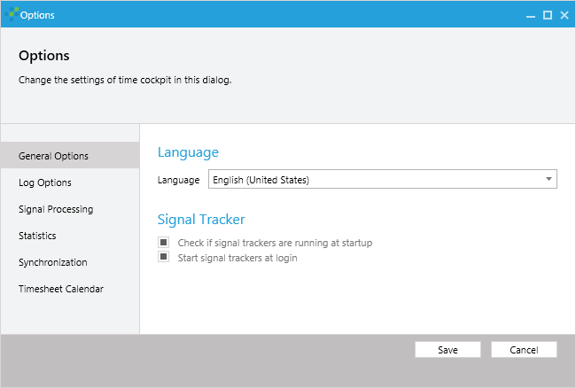
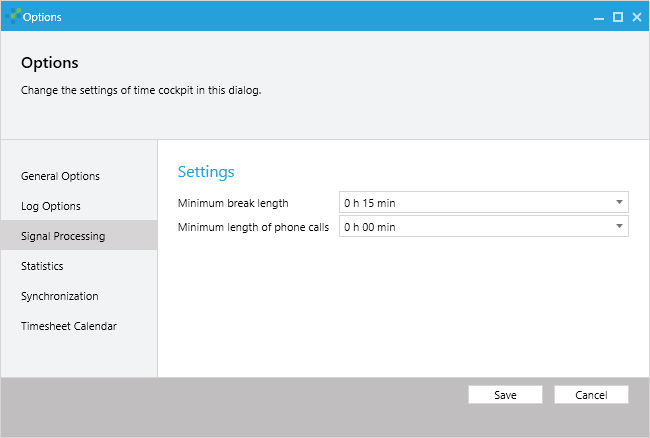

# Signal Tracker Options

In the application menu of time cockpit in the upper left corner you will find the options dialog that helps you to configure how signals should be processed and displayed.

## Signal Tracker Startup Options

In the **General Options** you can specify if time cockpit should check on startup, if the signal trackers are running. If this option is checked, time cockpit will remind you to start the signal trackers when you start time cockpit (in case they are not running).

The second option specifies if the signal trackers should be started automatically when you logon to your computer.

## Signal Processing Options

In the **Signal Processing** options you can specify the minimum break length. That means that breaks shorter than the specified time will be displayed as active time (see [Signal Tracker for Computer Activity](computer-activity.md)).

Furthermore you can specify the minimum duration for phone calls. Phone calls shorter than the specified time are not displayed in the calendar (see [Signal Tracker for Phone Calls](phone-calls.md)).

