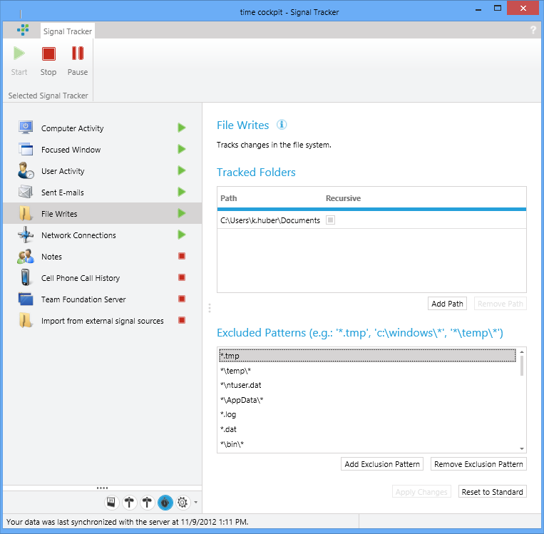
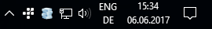
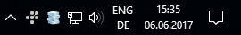
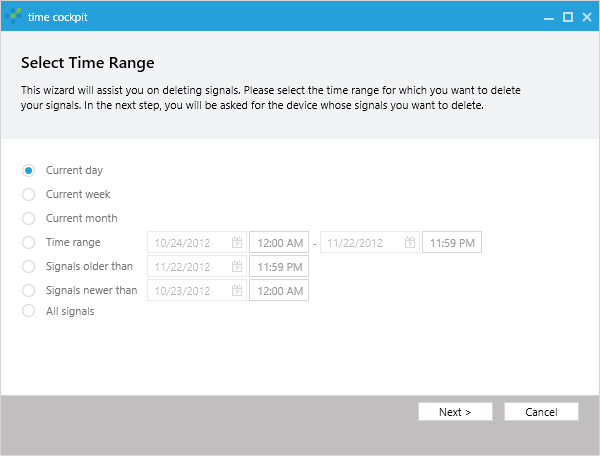

# Signal Trackers

Time cockpit contains a number of signal trackers, which track you activities on your PC. The tracked activities are called signals in time cockpit. They will be displayed in the graphical time sheet calendar to make booking your time easier.

Time cockpit contains the following signal trackers:

- [Computer activity](computer-activity.md)
- [User activity](user-activity.md)
- [Active windows](active-windows.md)
- [Sent emails (Microsoft Office Outlook)](sent-emails.md)
- [Changed files](changed-files.md)
- [Network connections](network-connections.md)
- [User notes](notes.md)
- [Phone calls](phone-calls.md)
- [Microsoft Team Foundation Server](team-foundation-server.md)
- [Importer for signals from text files](import-signals.md)

## Signal Tracker Configuration UI

The signal trackers run in the background. There is a time cockpit icon in the notification area, which indicates that the signal trackers are running. Double-click on the icon to open time cockpit. Right-click on the icon to get more options like terminating the signal trackers.

If the signal trackers are not running, just start time cockpit. On starting time cockpit checks if the signal trackers are running, and if they are not, time cockpit offers you to start them.

## Privacy

As long as the signal trackers are running in the background, they track your activites on your PC (see Signal tracker configuration UI). To prevent activity tracking you have the following options:

- Exit single signal trackers in the [Signal tracker configuration UI](#signal-tracker-configuration-ui). Please note that the terminated signal tracker will not be started automatically again, even if you reboot your computer. If you want to start it tracking again, you will have to start it manually.
- If you want to stop signal tracking temporarily, you can pause the signal trackers either in the [Signal tracker configuration UI](#signal-tracker-configuration-ui) or in the context menu of the icon in the notification area. This will pause all signal trackers. Please note that after a reboot the signal trackers will be started automatically.

The signal trackers do not track the content of tracked elements like the body of emails, files or visited websites. They only track the name or title of these elements like the email subject, file name or the title of websites.

Tracked signals are personal data of the user. time cockpit does not contain functions that allow to view signals from other users, and there is no way to aggregate signals to analyze them across users.

If you have finished your time sheet for a certain period and want to delete the corresponding signals, or if you have tracked signals that you do not want to keep, you can use the Ribbon button **Delete signals** to remove signals for a time range. You can delete all signals or only selected types.

> [!NOTE]
You can change the signal tracker from an opt-out model to an opt-in model by setting a registry key. For details see Auto-Start Behavior of Signal Trackers
