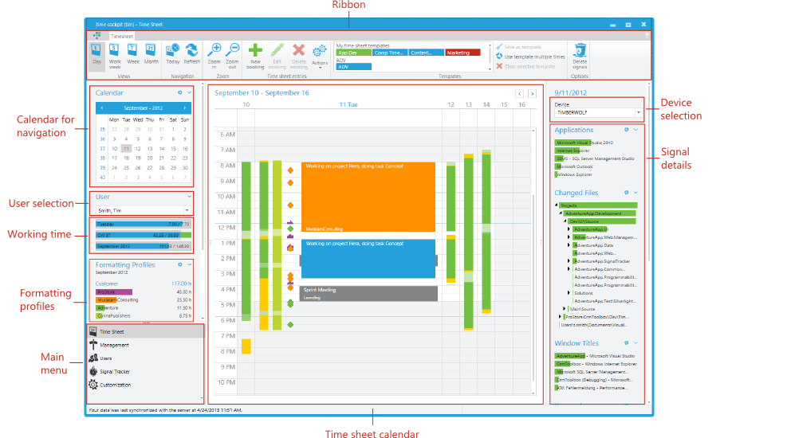
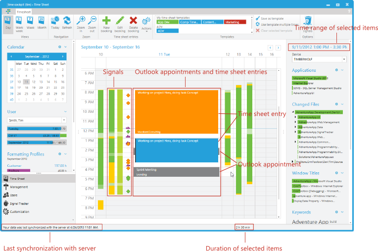
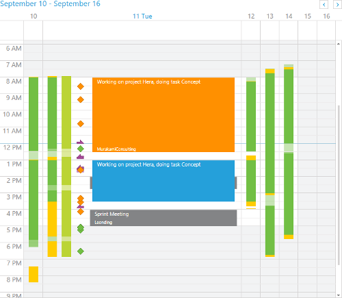
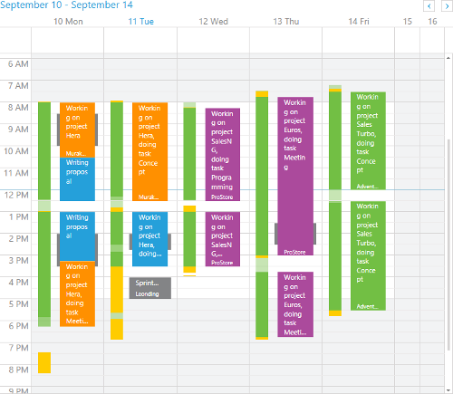
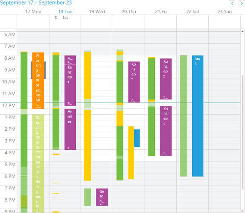
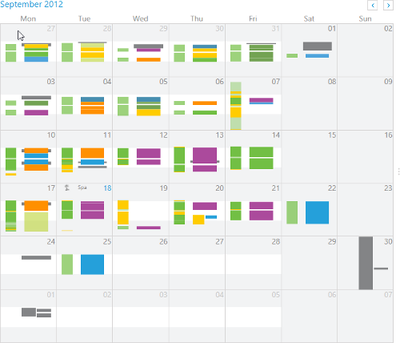

# Time Sheet Calendar

The time sheet calendar is the central data input tool in time cockpit. You can create time sheet entries manually or based on your tracked signals.

## Outline of the Time Sheet Calendar

The time sheet calendar consists of the following parts:

- Main menu
- Ribbon (contains commands that are available for the time sheet calendar or selected time sheet entries)
- Calendar for navigation
- [User selection](#user-selection)
- [Device selection](#device-selection)
- [Time sheet calendar](#time-sheet-calendar-1)
- [Working time](working-time.md)
- [Formatting profiles](formatting-profiles.md)
- [Signal details](signal-details.md)

## User Selection

Time cockpit synchronizes data automatically across all users of an account. In the user selection area you can select for which user the time sheet calendar should be displayed. Please note the following restrictions:

- Time cockpit provides a sophisticated permission system. You are able to specify read and write permissions for users and groups. Please find more information about permissions at [Permission Management](~/doc/data-model-customization/permission.md).
- Automatically tracked [signals](~/doc/signal-tracker/overview.md) are only synchronized across the devices from one user. **You are never able to view signals from another user.** No matter which user is selected in the user selection, you will always see your own signals. It is not possible to grant users the permission to view signals from another user.

Since version 1.7 of time cockpit you are able to hide users in the user selection list. Switch to **Users** in the main menu and open the **User Details** list. Open the user you want to hide and check the **Hidden** check box.

## Device Selection

Time cockpit automatically synchronizes data across your devices. You can view all your [signals](~/doc/signal-tracker/overview.md) on each device. Signal data is only synchronized across devices from one user. You are never able to view signals from other users. It is not possible to change this behavior.

## Time Sheet Calendar

The time sheet calendar visualizes signals, Microsoft Office Outlook appointments and time sheet entries. You can manually create, change or delete time sheet entries, or you can create them with help of signals or Microsoft Office Outlook appointments. The time sheet calendar consists of the following parts:

### Day, Work Week, Week and Month View

You can switch between the following views in the time sheet calendar:

- day view
- work week view
- week view
- month view

Use the day view if you want to create your time sheet entries based on your collected signals and your Microsoft Office Outlook appointments. In the week and work week views you get an overview of your working time but you can also create and change time sheet entries in these views. The month view is only designed to give you an overview of the whole month.

### Zoom

In the day, work week, and week view you can change the scaling of the time axis by zooming in and out. The function is especially helpful if you have lots of signals in a short time span. You can change the zoom level by one of the following ways:

- Press the **CTRL** key, keep it pressed and use the mouse wheel to change the zoom level.
- Use the ribbon commands **Zoom** in and **Zoom out**.
- Press **CTRL + (+)** to increase the zoom level and **CTRL + (-)** to decrease the zoom level.

### Navigation

You can navigate between days in the calendar by one of the following ways:

- Click on a day in the calendar for navigation in the left bar.
- Press **CTRL + right arrow** for the next day, **CTRL + left arrow** for the previous day, **CTRL + down arrow** for the next week and **CTRL + up arrow** for the previous week.