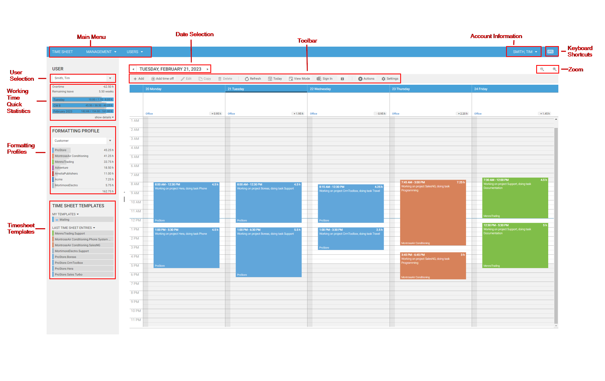
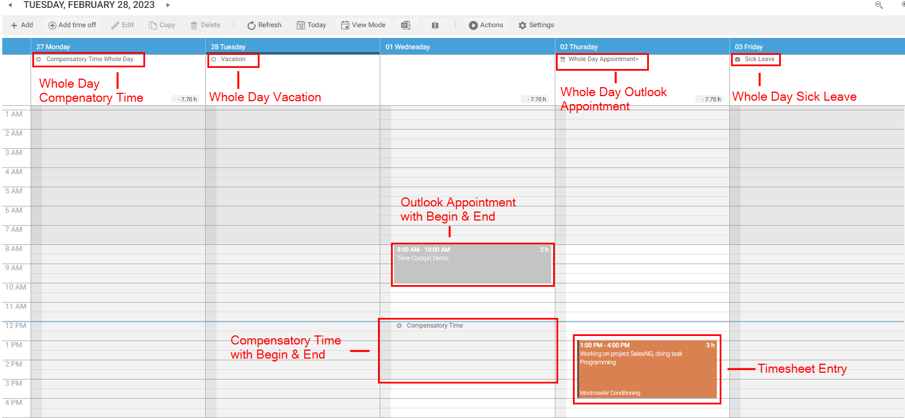
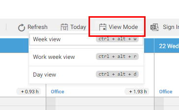
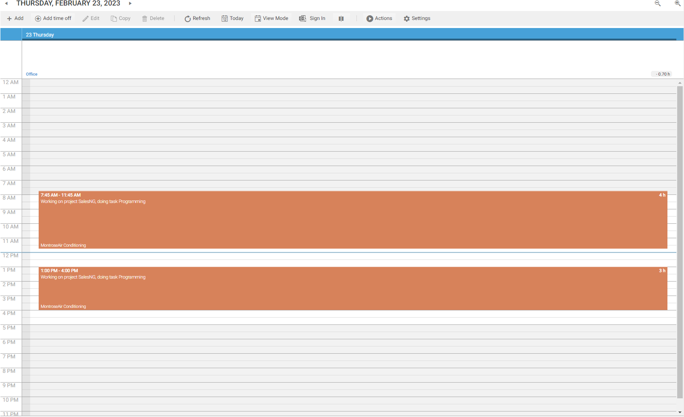
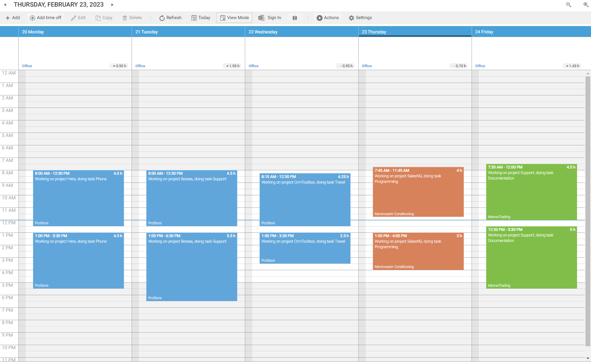
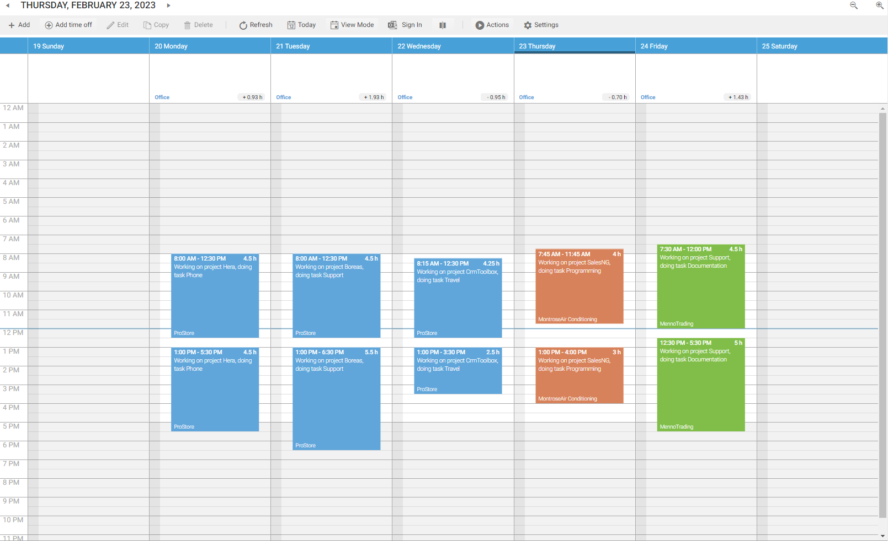
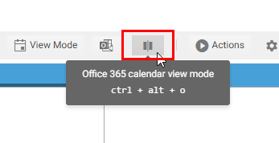
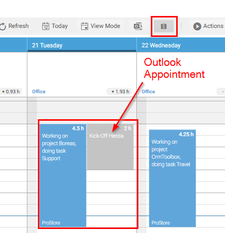
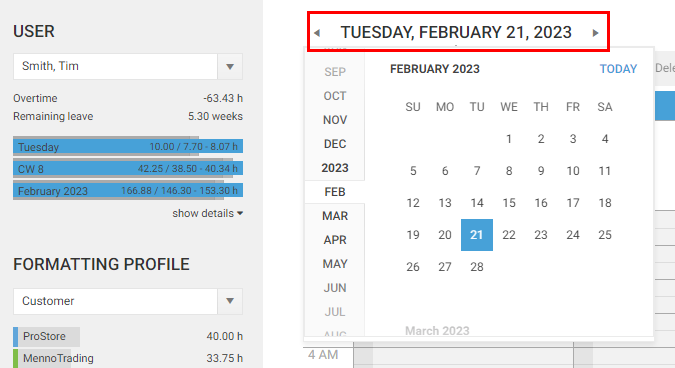

# Time Sheet Calendar

The time sheet calendar is the main tool to create timesheet entries in time cockpit. Please refer to [Working with Timesheet Entries](working-with-timesheet-entries.md) to learn how to create and edit your timesheet entries.

## Elements of the Time Sheet Calendar

The time sheet calendar consists of the following parts:

- [Main menu](#main-menu)
- [Toolbar](#toolbar)
- Date selection
- [User selection](#user-selection)
- [Time sheet calendar](#time-sheet-calendar-1)
- [Working time](working-time.md)
- [Formatting profiles](formatting-profiles.md)
- [Timesheet Templates](timesheet-templates.md)
- [Account Information](account-information.md)

## Main menu

The main menu consists of so called modules (Timesheet, Management, User). 

* The Timesheet module opens the timesheet calendar
* The Management module provides lists to manage your base data (customer, projects, tasks, etc.)
* the User module provides lists to mangage all user/employee related data.

## Toolbar

The toolbar provides commands that are available for the time sheet calendar or selected time sheet entries.

## User Selection

In the user selection area you can select the user for which the time sheet entries should be displayed. Please note the following restrictions:

- Time cockpit provides a sophisticated permission system. You are able to specify read and write permissions for users and groups. Please find more information about permissions at [Permission Management](~/doc/data-model-customization/permission.md).

> [!NOTE] By default, time cockpit does not ship any permissions. Everybody is allowed to see everything.

Since version 1.7 of time cockpit you are able to hide users in the user selection list. Switch to **Users** in the main menu and open the **User Details** list. Open the user you want to hide and check the **Hidden** check box.

## Time Sheet Calendar

The time sheet calendar shows different types of information:

* Timesheet Entries
* Absence Times (vacation, compensatory time off, sick leave). See also [Absence Time Management](~/doc/employee-time-tracking/absence-time-management.md).
* Outlook Appointments and Sent Mails from your Office 365 account. See also [Office 365](office365.md).

You can manually create, change or delete time sheet entries, or you can create them with help of signals or Microsoft Office Outlook appointments. The time sheet calendar consists of the following parts:

### Day, Work Week, Week and Month View

You can switch between the following views in the time sheet calendar using the toolbar.

Use the day view e.g. if you want to create your time sheet entries based on your Microsoft Office Outlook appointments. In the week and work week views you get an overview of your working time but you can also create and change time sheet entries in these views. The latter two views are also convenient if you want to copy/move a time sheet entry to another day in the same week

Besides changing the granularity of the time sheet calendar, you can also choose how to view your data. If you have enabled the Office365 integration, you can choose to display Outlook appointments and timesheet entries side-by-side.

Enabling this option shows timesheet entries and Outlook appointments side-by-side.

### Zoom

In the day, work week, and week view you can change the scaling of the time axis by zooming in and out. You can change the zoom level by one of the following ways:

- Press the **CTRL** key, keep it pressed and use the mouse wheel to change the zoom level.
- Use the zoom commands in the top right corner of the timesheet calendar **Zoom** in and **Zoom out**.

### Navigation

You can navigate between days and weeks in the calendar the following ways:

* If you are in the day view, press **CTRL + right arrow** for the next day, **CTRL + left arrow** for the previous day

* If you are in the week view, press **CTRL + right arrow** for the next week, **CTRL + left arrow** for the previous week

To select a specific date, use the date picker at the top of the timesheet calendar.

