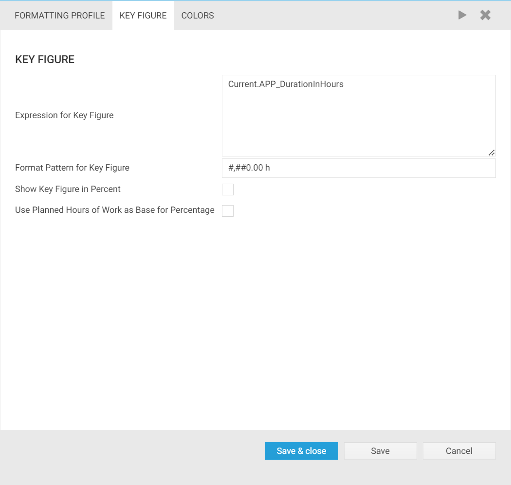

# Formatting Profiles	

Time cockpit's graphical calendar is designed to provide you with an instant overview about how you spent your time. With formatting profiles you can define conditional formatting rules that control how time sheet entries are displayed in the graphical calendar. You can influence the text that time cockpit displays in the header and footer of time sheet entries in the calendar. Additionally, you can define the background color of time sheet entries. Here are some examples for situation in which conditional formatting might be useful:

- Display billable and non-billable time sheet entries in two different colors to get a quick visual feedback about the ratio of billable time.
- Display incomplete time sheet entries (e.g. entries without project assignment) in red. You will easily discover them at the end of the month when you have to complete your time sheet.
- Display all time sheets with the world "travel" in the description in a specific color. When you create your travel expense reports, you will easily find time sheet entries related to travels.

While conditional formatting for individual time sheet entries provides instant feedback about the status of each single entry, you might also need an overview about the structure of your work for an entire day, week, or month. Time cockpit provides this in the navigation pane of the calendar. Based on the conditional formatting rule used for background colors, you will get a bar chart showing you the allocation of your work. The KPI (key performance indicator) used in the bar chart is customizable. You can use any numeric field in time sheet records (e.g. duration in hours, revenue) when defining the formula for the KPI. Here are some examples for situation in which you might want to use the bar charts:

- You need to know on which projects you spent most of your time in a certain week. Time cockpit can display a bar chart with the total working hours per project.
- You need to know the number of billable hours vs. non-billable hours. Time cockpit can show you a bar chart with two data bars: billable hours and non-billable hours.
- You need to get an overview on how much money you have earned with each customer in a certain month. Time cockpit can display a bar chart with the revenue per customer.

## Formatting Profiles in the Time Sheet Calendar

Formatting profiles influence three areas in the time sheet calendar:

- In the navigation pane (left) you see the bar charts mentioned above, you configure the formatting profiles, and select the currently active profile.
- In the main area of the calendar the active formatting profile specifies how time cockpit generates caption and footer texts as well as background color of time sheet entries.
- Template bookings in the ribbon are also colored based on the currently active formatting profile.

## Formatting Profile Settings

You configure the settings for formatting profiles in the navigation pane in the left area of the time sheet calendar. Left-click on the blue gear to change these settings.

- The first area in the menu allows you to select the visible formatting profiles. Time cockpit will display bar charts for all profiles that you select in this area.
- The second area specifies the time range used for the values in the bar chart. You can calculate the values for the month, week, or day which is currently selected in your time sheet calendar.
- The third area allows you to change the sort order of the bars in the chart. You can order them by value (descending) or by text (ascending).
- The fourth area allows you to add new, edit existing, or delete existing formatting profiles. These three menu items are also available in the context menu of each formatting profile.

> [!NOTE]
Note that time cockpit displays the formatting profiles in the order that you select them. You can change the display order by dragging the profile's title.

> [!NOTE]
Time cockpit will save the configuration of your formatting profiles on your PC. If you work on multiple PCs and/or with time cockpit's browser client, time cockpit will not synchronize your settings across your clients.

Although you can display multiple formatting profiles in the navigation pane, only one of them can be active. Click anywhere in the bar chart to select the corresponding formatting profile to activate it. The active profile defines the conditional formatting in your time sheet calendar. Its bar chart is displayed in color. All other formatting profiles are inactive and displayed in gray.

## Edit Formatting Profiles

In the navigation pane of the time sheet calendar you can maintain your formatting profiles. To add, edit, or delete a formatting profile, right-click a profile or select the settings menu for formatting profiles (blue gear).

The configuration dialog for formatting profiles consists of three areas:

- General settings
- Key figure (used for bar charts)
- Color settings

## General Settings
In the general settings for formatting profiles you can specify the following settings:

### Name

Note that the name field can contain an expression. In this case it has to start with an equal sign ("=") to indicate that the value is not a constant string but an expression. Typically you will enter a constant string in the name field. The only exception is the need for a name that is different for each language. In this case you could use the :Translate function in the name expression.

### Expression for Footer (Optional) and Expression for Description (Optional)

Enter an expression that is used to get the caption and footer texts for a time sheet entry in the calendar. Use Current to access the displayed time sheet entry. You can access all properties and relations of APP_Timesheet.

Examples:

- `Current.Description` display the description of the time sheet entry in the calendar
- `Current.Description + ' (' + Current.Project.Description + ')'` display the description of the time sheet entry concatenated with the description of the associated project

> [!NOTE]
Note that the description could contain a constant string, too. However, in practice you will mostly use a formula.

### Expression for Grouping Time Sheet Entries (Optional)

Enter an expression that returns a string. Time cockpit will generate a row for each distinct value and calculate the aggregated key figure for it.

Examples:

- `:Iif(Current.Billable=True, 'Billable', 'Not Billable')`
- `:Current.Project.Description`
- `:Iif(Current.Billable=True, :Translate('FormattingProfile.Billable.Billable'), :Translate('FormattingProfile.Billable.NotBillable'))` Sample demonstrating the use of the :Translate function

> [!NOTE]
Do not return a color code or the name of a color. The color is assigned later in the configuration (see below). In this step we only need the caption for the bar chart row. Note that you can use the :Translate function if you need to support different languages.

### Visible For All Users

If you check this checkbox, all users will be able to use, modify, and delete your formatting profile. If it is unchecked, the formatting profile is only available for you.

## Key Figure Section

The key figure section allows you to specify which key figure should be used in the bar chart.

### Expression For Key Figure

Enter an [expression](~/doc/tcql/expression-language.md) for the key figure that should be used to generate the bar chart. Use `Current` to access the displayed time sheet entry. You can access all properties and relations of `APP_Timesheet`.

The key figure will be aggregated for all distinct values of the grouping expression (see above). In our example (see screenshots), time sheet entries are grouped into two distinct groups: billable entries and non-billable entries. The specified key figure is `APP_DurationInHours`. Therefore you will get two bars in the chart that show the number of billable and non-billable hours.

Examples:

- `Current.APP_DurationInHours`
- `Current.APP_Revenue`

### Format Pattern For Key Figure

Enter a format pattern used to display the aggregated key figure.

Examples:

- `#,##0.00 h`
- `#,##0 EUR`

### Show Key Figure in Percent

If you check this checkbox, you will not see the absolute value of the aggregated key figure besides the bars but the percentage. In the tooltip you will always see both the value in percent and the absolute value. The format pattern (see above) is only used for the absolute value.

### Use Planned Hours of Work as Base For Percentage

You can only check this checkbox if you have chosen to show the key figure in percent. It specifies that the base value of the percentage is not the sum of all key figures values but the planned hours of work for the selected month, week, or year. If you have worked 27 hours on the third workday of a month and 24 of them are billable, you have 100% billable hours assuming that you plan to work eight hours per day. If you do not use the planned hours of work as base, you only have 88% billable hours out of 27 hours. This option only makes sense if you use a key figure that returns hours. For key figures like `APP_Revenue` that return an amount of money, the calculated percentage would not make sense.

## Color Settings

The colors section allows you to assign colors to the distinct values of the grouping expression. You do not need to specify a color for each value. Time cockpit will automatically pick a color for each value whenever it needs one for the calendar. The automatically assigned colors may change each time you start time cockpit. If you always want to get the same color for a specific value, you have to assign it manually. The easiest way to start with assigning colors is to click on the **Get values for background color expression** link. Time cockpit will pick a color for each possible value of the grouping expression. You can then modify the colors as you like. If you click the link to generate colors a second time, time cockpit will not override existing values but it will only add missing values.

