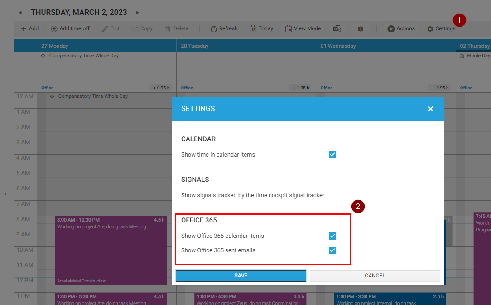
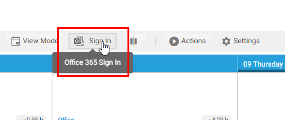
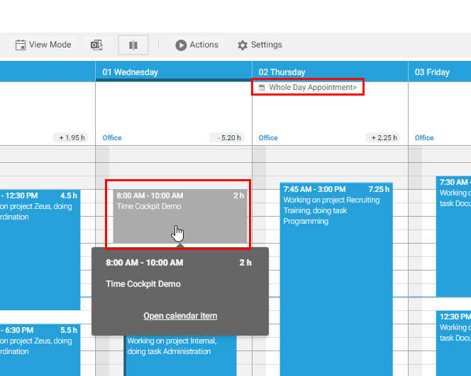
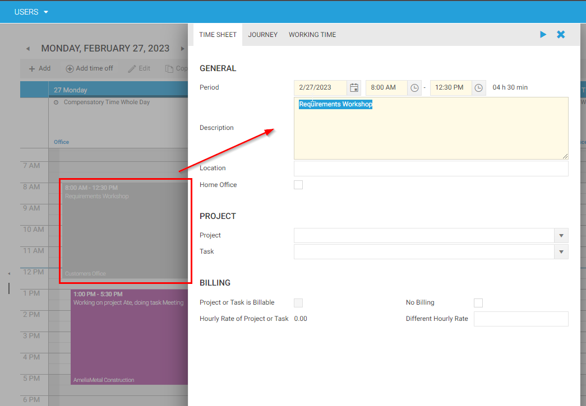

# Office 365 Integration

Connect time cockpit with your Office 365 account to display Outlook appointments and sent emails directly in your time sheet calendar, providing a holistic view of your workday.

> [!TIP]
> **Want to streamline your time tracking?** Office 365 integration helps you track time more accurately by syncing your calendar and emails. Learn more about [time tracking integrations](https://www.timecockpit.com/features/integration/).

## Overview

Office 365 integration brings your Microsoft 365 data into time cockpit:

**Calendar Appointments:**
- View Outlook appointments alongside timesheet entries
- Transform appointments into billable time entries with one click
- See meeting schedules while tracking time

**Sent Emails:**
- Display sent emails from Outlook in your calendar
- Identify client communication and activities
- Reference email threads when creating time entries

**Benefits:**
- ✅ Reduce manual time entry (convert appointments to timesheets)
- ✅ Improve accuracy (see what you actually did during the day)
- ✅ Capture all activities (meetings, emails, focused work)
- ✅ Context for retroactive time tracking

## Supported Office 365 Services

**Microsoft Outlook Online (web-based)**
- ✅ Calendar appointments
- ✅ Sent emails
- ✅ OAuth authentication

**Microsoft Outlook Desktop** (via Office 365 sync)
- ✅ Calendar sync through Office 365 online
- ✅ Email sync through Office 365 online

**Requirements:**
- Active Office 365 / Microsoft 365 subscription
- Web browser access to time cockpit ([web.timecockpit.com](https://web.timecockpit.com))
- Office 365 account credentials

> [!NOTE]
> The integration connects to **Office 365 cloud services**. If you use a standalone Outlook installation without Office 365, this integration is not available.

## Configuring Office 365 Integration

### Step 1: Enable Office 365 Features

1. Open **[Time Sheet Calendar](https://web.timecockpit.com/app/calendar)** in time cockpit
2. Click **Settings** (gear icon or settings button)
3. Enable the following options:
   - ☑ **Show Office 365 calendar items**
   - ☑ **Show Office 365 sent mails**
4. Click **Save** or **Apply**

### Step 2: Sign In to Office 365

1. In the time cockpit toolbar, click **Sign In** (Office 365 login button)
2. **Office 365 login window opens** (may open in background - use Alt+Tab to find it)
3. Enter your **Office 365 email address**
4. Enter your **Office 365 password**
5. Approve the **permission request**:
   - Time cockpit requests read access to:
     - Your calendar
     - Your sent emails
   - Click **Accept** or **Allow**
6. Login window closes automatically upon success

> [!NOTE]
> The OAuth login may open in a background tab or window. If you don't see the login prompt immediately, check your open windows (Alt+Tab on Windows, Cmd+Tab on Mac).

### Step 3: Refresh to Load Data

1. Click **Refresh** button in time cockpit toolbar
2. Wait for data to load (may take 10-30 seconds depending on calendar size)
3. **Outlook appointments and emails** now appear in your calendar

## Using Office 365 Data in Time Tracking

### Viewing Appointments in Calendar

**Appointments appear in calendar:**
- Displayed alongside timesheet entries
- Different visual style (may be slightly transparent or different color)
- Show appointment time, title, location
- **Cannot be edited** in time cockpit (read-only)

**Calendar views:**
- **Day View**: See hourly schedule with appointments
- **Week View**: Overview of meetings throughout week
- **Month View**: High-level view of appointment distribution

### Converting Appointments to Timesheet Entries

Transform an Outlook appointment into a billable time entry:

**Quick Conversion:**
1. **Double-click** the appointment in your calendar
2. Time cockpit creates a **new timesheet entry** with:
   - ✓ Start time (from appointment)
   - ✓ End time (from appointment)
   - ✓ Description (from appointment title)
   - ✓ Location (if in appointment)
3. **Complete the entry** by adding:
   - Project/Task (required for billing)
   - Additional notes or details
   - Mark as billable (if applicable)
4. Click **Save**

**Use cases:**
- Convert client meetings to billable time
- Log internal meetings to correct projects
- Track travel time from calendar events
- Capture conference calls and webinars

### Viewing Sent Emails

**Sent emails appear in calendar:**
- Timeline view shows when emails were sent
- Email subject displayed
- Helps reconstruct what you worked on

**Using email data for time tracking:**
- **Reference point**: "I emailed client at 2pm, so I worked on their project from 1-3pm"
- **Activity indicator**: Bursts of emails = active work on topic
- **Client communication**: Count as billable time for some clients
- **Retroactive tracking**: Fill in gaps by reviewing email activity

**Creating entries from emails:**
1. See sent email in calendar (e.g., "Proposal sent to Acme Corp")
2. Click to create new time entry for that timeframe
3. Enter project: Acme Corp
4. Description: "Prepared and sent project proposal"
5. Save

## Security & Privacy

### Permissions Requested

Time cockpit requests **read-only access**:
- ✓ Read calendar appointments
- ✓ Read sent emails
- ✗ Cannot send emails on your behalf
- ✗ Cannot modify or delete appointments
- ✗ Cannot access email content (only metadata: subject, time, recipients)

### Data Storage

- **Calendar and email data** is **not stored** on time cockpit servers
- Data is **fetched on-demand** when you refresh
- Only **timesheet entries you create** are stored in time cockpit
- Appointments and emails remain in Office 365

### Revoking Access

To disconnect time cockpit from Office 365:

1. Navigate to [Office 365 Account Settings](https://account.microsoft.com/privacy/app-access)
2. Find "Time Cockpit" in connected apps list
3. Click **Remove** or **Revoke Access**
4. Confirm removal

Time cockpit will no longer display appointments or emails.

## Troubleshooting

### Appointments Not Showing

**Problem**: Enabled Office 365 but don't see appointments

**Solutions:**
1. **Verify sign-in**: Check that you're logged in (look for Office 365 icon/status)
2. **Click Refresh**: Manually refresh to fetch latest data
3. **Check date range**: Ensure calendar is viewing dates with appointments
4. **Verify calendar has events**: Log into Office 365 web ([outlook.office.com](https://outlook.office.com)) to confirm appointments exist
5. **Re-authenticate**: Sign out and sign back in to Office 365 in time cockpit

### Login Window Not Appearing

**Problem**: Clicked "Sign In" but no login window appears

**Solutions:**
1. **Check background windows**: Press Alt+Tab (Windows) or Cmd+Tab (Mac) to find popup
2. **Check browser popup blocker**: Allow popups for [web.timecockpit.com](https://web.timecockpit.com)
3. **Try different browser**: Some browsers block OAuth popups
4. **Clear browser cache**: Clear cache and cookies, try again

### Emails Not Displaying

**Problem**: Appointments show but emails don't

**Solutions:**
1. **Verify "Show Office 365 sent mails" is enabled** in Settings
2. **Check date range**: Emails only show for dates you're viewing
3. **Confirm emails were sent**: Log into Outlook web to verify sent emails exist in that timeframe
4. **Permission issue**: Re-authenticate to Office 365 to ensure email read permission granted

### Performance/Slow Loading

**Problem**: Calendar loads slowly after enabling Office 365

**Solutions:**
1. **Large calendar**: If you have 1000s of appointments, initial load takes longer
2. **Network speed**: Slow internet = slow Office 365 data fetch
3. **Disable if not needed**: Turn off Office 365 integration when not actively using it
4. **Use day view**: Day view loads less data than week/month

## Comparison: Office 365 vs. Local Outlook

| Feature | Office 365 Integration | Local Outlook (Desktop Only) |
|---------|------------------------|------------------------------|
| **Calendar sync** | ✅ Yes (via Office 365 cloud) | ⚠️ Limited (desktop client only) |
| **Email sync** | ✅ Yes (sent emails) | ⚠️ Limited |
| **Authentication** | OAuth (secure, passwordless) | N/A |
| **Works in web client** | ✅ Yes | ❌ No (desktop only) |
| **Works on mobile** | ✅ Yes | ❌ No |
| **Requires subscription** | Yes (Office 365/M365) | No (but desktop client only) |

**Recommendation:** Use Office 365 integration for best experience, especially if using web client or mobile.

## Related Features

### Time Tracking
- [Time Sheet Calendar](calendar.md) - Main calendar interface
- [Working with Timesheet Entries](working-with-timesheet-entries.md) - Creating and editing entries
- [Timesheet Templates](timesheet-templates.md) - Automate recurring entries

### Other Integrations
- [Web API Overview](../web-api/overview.md) - Build custom integrations
- [Data Import](../data-exchange/import.md) - Import from other systems
- [Data Export](../data-exchange/export.md) - Export to other tools

### Mobile & Access
- [Mobile Guide](../getting-started/mobile-guide.md) - Using time cockpit on phones/tablets
- [Web Client](../getting-started/web-client.md) - Browser-based access

## See Also

**FAQs:**
- [User FAQ](../user-faq.md) - General time tracking questions
- [Employee FAQ](../employee-faq.md) - Daily time entry questions

**Website Resources:**
- [Integration Features](https://www.timecockpit.com/features/integration/) - Overview of time cockpit integrations

---

*For Office 365 integration support, contact [support@timecockpit.com](mailto:support@timecockpit.com) or see the [User FAQ](../user-faq.md).*
