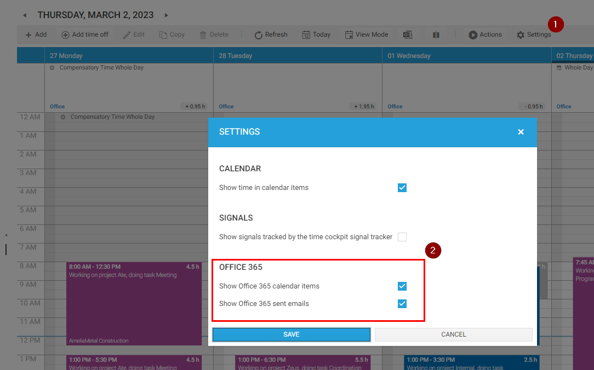
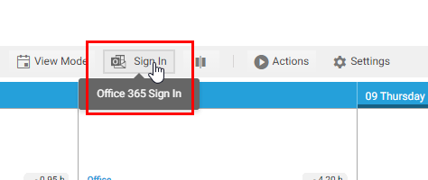
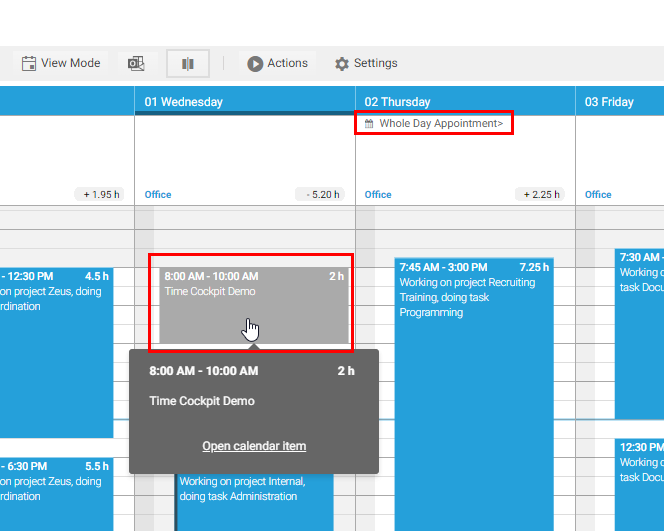
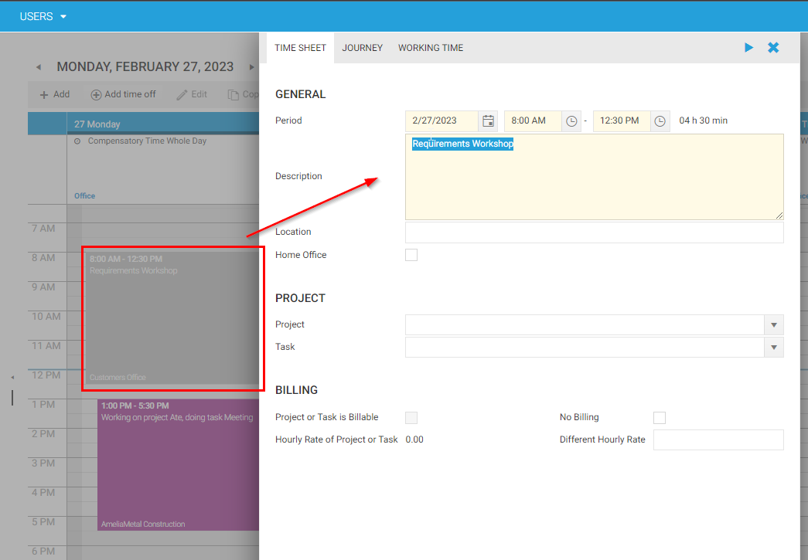
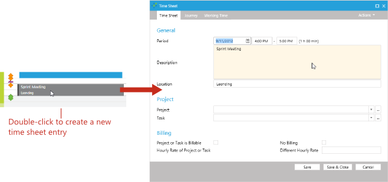

# Working With Outlook Appointments

Time cockpit can be integrated with your Office 365 account. Once the connection is configured, time cockpit can display your Outlook appointments and sent emails directly in your time sheet calendar. This functionality is particularly useful booking your time as it gives you a good idea of how you have spent your working day. Sent emails are also a good indication of your activities throughout the day. 

By connecting time cockpit with your Office 365 account, you can gain a more holistic view of your workday and easily track and manage your time.

## Configure the Office 365 Connection

* In the time sheet calendar, click **Settings** and enable **Show Office 365 calendar items** and **Show Office 365** sent mails. 

* Click **Sign In** in the time cockpit toolbar and enter your Office 365 credentials

> [!NOTE]
The login might open in the background. So check your windows with Alt + Tab if you are not immediately seeing the Office 365 prompt

* Click **Refresh** in the time cockpit toolbar to fetch Outlook appointments and mails from Office 365.

> [!NOTE]
To transform your Outlook appointment to a time sheet entry just double-click it and enter missing data.

<!-- > [!NOTE]
If you are not using Microsoft Office Outlook to manage your appointments, time cockpit cannot display your appointments at the moment.

In the right area of a day in the time sheet calendar time sheet entries and Microsoft Office Outlook appointments are displayed. Microsoft Office Outlook appointments cannot be changed. You can double-click an appointment to create a new time sheet entry with the corresponding time span, description and location. The new time sheet entry will be opened and you can complete the data for the time sheet entry.

 -->