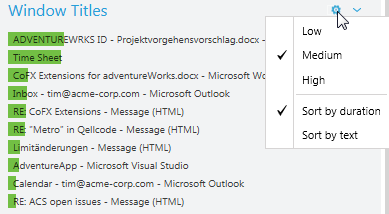
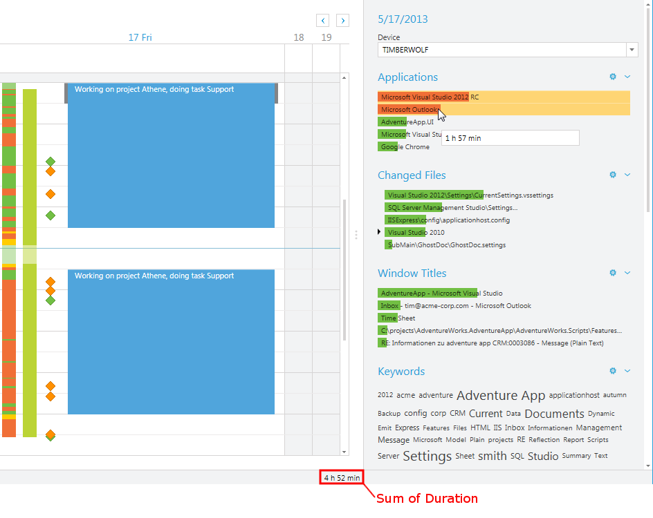
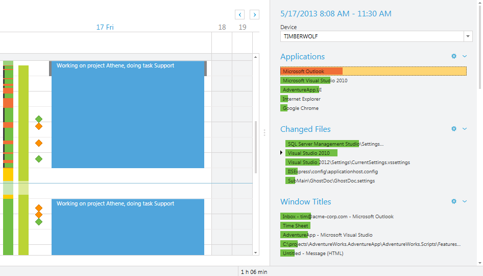
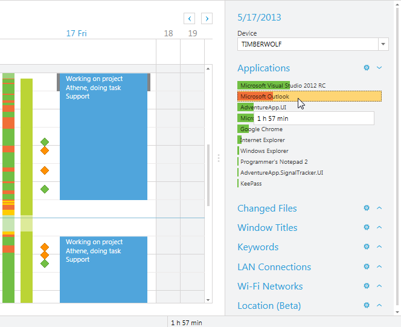
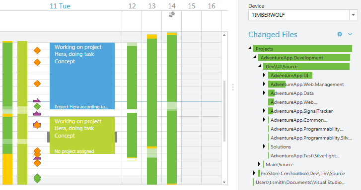
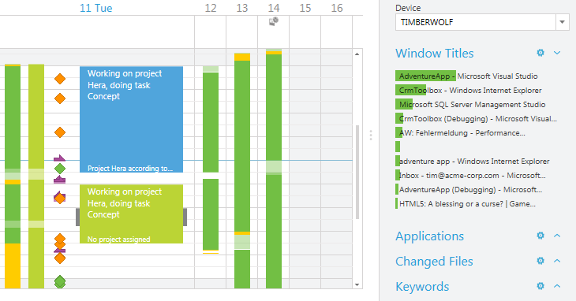
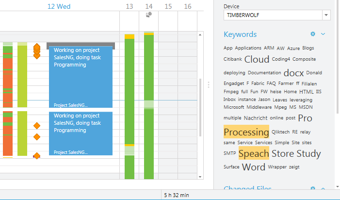
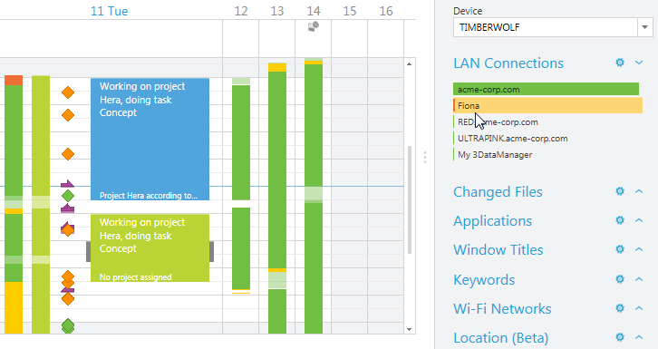
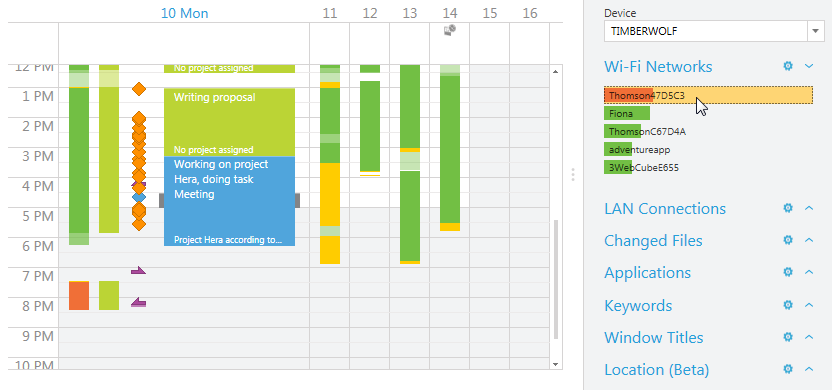

# Signal Details

The signal details pane displays details about collected signal data (see also [Signal Tracker](~/doc/signal-tracker/overview.md)).

time cockpit shows the following additional information in the signal details pane:

- Applications (lists application that were used)
- Changed Files (lists files that were modified)
- Window Titles (lists the application windows that were in focus)
- Keywords ([tag cloud](http://en.wikipedia.org/wiki/Tag_cloud))
- LAN Connections
- Wi-Fi Networks

## Working with the Signal Details Pane

The signal details pane shows information about the currently selected period of time. If you select a time sheet entry, the signal details pane displays details on the signals that have been tracked in the corresponding period of time. If you do not select a period, the signal details pane shows the details of all the signals that have been tracked during that specific day.

Each signal category (application, changed files...) in the signal details pane can be collapsed. This is especially helpful if you are working on devices with restricted screen estate. time cockpit only shows the most important items for each signal category that is, the items you spent most time on. With histograms, you can choose between the detail levels Low, Medium and High. The Keywords cloud shows a keyword the bigger the more time you spent on it.

> [!NOTE]
In the keywords cloud, you can change the level of detail either in the context menu (compare histograms), but also via **Ctrl**-Mouse Wheel.

The provide information about when you have been doing what, the signal details pane interacts with the Combined Activity track in the time sheet calendar. You can select an item in the signal details pane (e.g. a bar in the application signal category) and time cockpit displays the period of time when you have used the given application. If you select additional bars while holding down the **Ctrl** key, you can select multiple bars.

If you hover over a single bar with your mouse, a tooltip shows you the duration of the e.g. selected application you are currently hovering over. If you select multiple applications, time cockpit shows you the sum of the duration in the lower right area of the status bar.

If you select a period of time in the combined activity track, the signal details pane shows you only information about signals tracked in the selected period of time. The selection of a period of time in the combined activity track is displayed as a black bar at the left side of the track. You can now select an item in the signal details pane (e.g. Microsoft Office Outlook) and time cockpit will only show you the occurrence of the selected signal in the selected period.

## Applications

The applications that you have used throughout a day on a device are displayed as a [histogram](https://en.wikipedia.org/wiki/Histogram) in the Applications category in the signal details pane. It displays the data captured by the [Signal Tracker for Active Windows](~/doc/signal-tracker/active-windows.md).

The length of a bar in the histogram represents the duration how long an application was in the foreground and in focus. Background programs (e.g. programs not in focus, or background services) are not considered.

## Changed Files

The changed files [histogram](https://en.wikipedia.org/wiki/Histogram) shows the files that you have created or modified. The data for this histogram is provided by the [Signal Tracker for Changed Files](~/doc/signal-tracker/changed-files.md).

The creation or modification of a file is by definition no exact point in time. Thus, time cockpit links the alteration of a file with the application that was in the foreground and in focus while a file was altered (see also [Applications](#applications)). That way, time cockpit can calculate a continuous duration you have been working on a file.

## Window Titles

Windows titles are displayed as [histogram](https://en.wikipedia.org/wiki/Histogram). The data for this histogram is provided by the [Signal Tracker for Active Windows](~/doc/signal-tracker/active-windows.md).

The length of a bar in the histogram represents the duration how long a window was in the foreground and in focus. Background programs (e.g. programs not in focus, or background services) are not considered. If you hover over a selected window title with your mouse, time cockpit shows you the duration you have used the application. If you select multiple window titles, time cockpit shows you the sum of the duration in the lower right area of the status bar.

## Keywords

The keywords are displayed as a [tag cloud](https://en.wikipedia.org/wiki/Tag_cloud). It summarizes data of all the other categories (applications, window titles, changed files...). It is provided with data from all other Signal Trackers.

The font size of a term in the tag cloud represents the duration of the corresponding signal. The bigger a term in the tag cloud, the longer the duration you were occupied with it. Like in the other signal categories in the signal details pane, you can also select multiple terms in the tag cloud. If you hover over a selected window title with your mouse, time cockpit shows you the duration you have used the application. If you select multiple window titles, time cockpit shows you the sum of the duration in the lower right area of the status bar.

## LAN Connections

The LAN connections are displayed as a [histogram](https://en.wikipedia.org/wiki/Histogram). It shows the LAN connections a device you were working on was connected to throughout a day. It is provided with data from [Signal Tracker for Network Connections](~/doc/signal-tracker/network-connections.md).

The length of a bar in the histogram represents the duration how long you were connected to an available connection. As with all the other signal categories, if you select a network in the signal details pane, the period of time you were connected to the network is marked in the combined activity track in the time sheet calendar.

## Wi-Fi Networks

The Wi-Fi Networks are displayed as a [histogram](https://en.wikipedia.org/wiki/Histogram). It shows the Wi-Fi networks a device you were working on was connected to throughout a day. It is provided with data from [Signal Tracker for Network Connections](~/doc/signal-tracker/network-connections.md).

The length of a bar in the histogram represents the duration how long an available Wi-Fi network was available. It does not matter if you were connected to the network. time cockpit only tracks the availability.

> [!NOTE]
This tracker is very helpful if you are travelling a lot and work with different available Wi-Fis. A lot of customers have their name in the Wi-Fi SSID. Thus, it is often easy to determine where you have been by taking a look which Wi-Fis you were connected to.

