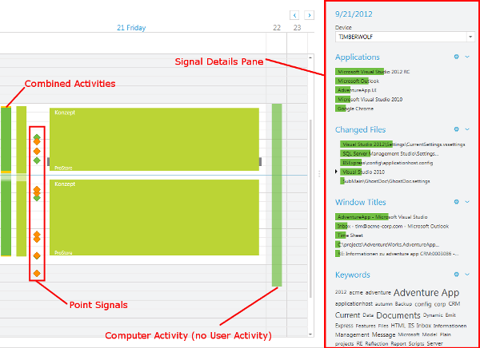
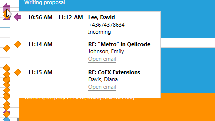
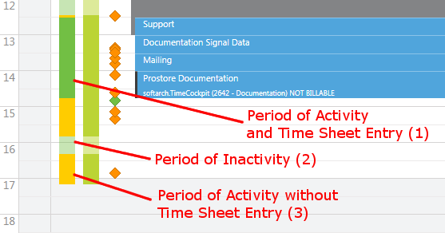
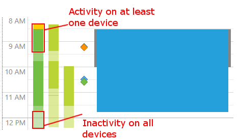
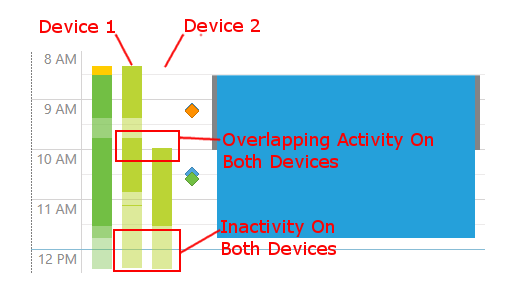
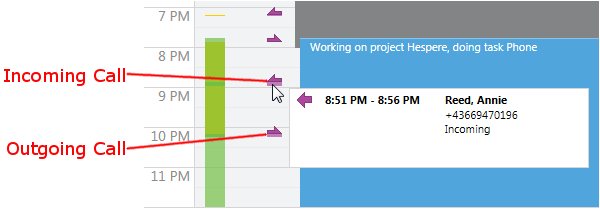
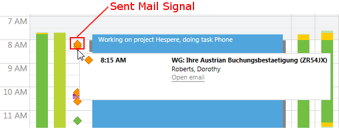
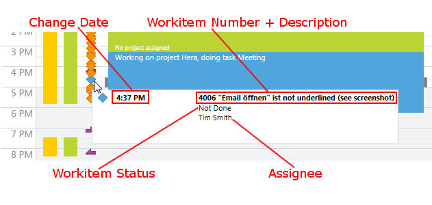
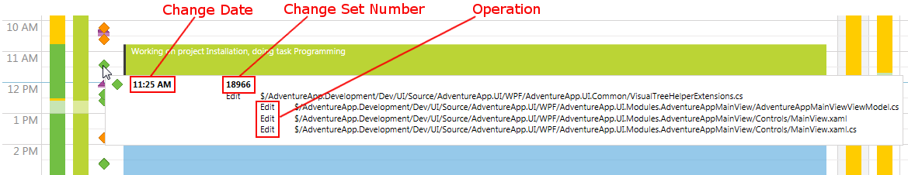

# Signals

In the right pane of the time sheet calendar you see the processed signals captured by the [Signal Tracker](~/doc/signal-tracker/overview.md). Signal data helps users to remember what they have spent their time on and create time sheet entries accurately. time cockpit distinguishes between **duration signals** and **point signals**. Duration signals are e.g. applications, window titles or user activity. Examples for point signals are sent mails, incoming and outgoing phone calls or a user note.

Time cockpit displays the following types of signals directly in the time sheet calendar:

- Duration Signals
    - Combined Activity
    - Computer- and User Activity
    - Telephone Calls
- Point Signals
    - User Notes
    - Sent Mails
    - TFS Workitem Changes
    - TFS Changesets

Besides the above signals, time cockpit shows additional signal types in the signal data pane:

- Duration Signals
    - Window Titles
    - Applications
    - LAN Connections
    - Wi-Fi Networks

The additional signal types and their visualization are described in detail at [Signal Details](signal-details.md).

## How to Use Signals

Signals are collected by the so called [Signal Tracker](~/doc/signal-tracker/overview.md) and cannot be changed by a user. You can use signal data to remember what you have done throughout a day and create accurate time sheet entries from the signals accordingly. If you double-click on the user activity signal track, time cockpit displays a time sheet entry form. time cockpit automatically uses the period of the selected period for the time sheet entry. When hovering over a point signal, time cockpit displays additional information about a point signal and offers context-sensitive actions.

Duration signals provide a lot of information about what a user has done and how long she has been occupied with it. For more on how to read the duration signals correctly refer to [Signal Details](signal-details.md).

## Combined Activities

The combined activities signal track is the left most bar in the time sheet calendar. This track is not only visible in the day view, but also the week and month view. This track subsumes the following information:

- Activity on any of your devices
- Time you have not spent on your device (e.g. computer)
- Periods where no time sheet entry exists

Periods where you have been active on any of your devices and where you have already created a time sheet entry are displayed in **dark green** (1). Periods of inactivity (e.g. you have taken a break) are displayed in **light green** (2). Periods where you have been active on any of your devices, but for which you have not created a time sheet entry yet are displayed in **yellow** (3).

> [!NOTE]
By default, periods of inactivity that are longer than 15 minutes are interpreted as breaks (light green). However, you can alter the threshold of minutes in the options dialog. For more information refer to [Signal Tracker Options](~/doc/signal-tracker/options.md).

With the combined activity track users can quickly find periods where they have worked on one of their devices, but have not created time sheet entries for that period of time. Thus, time cockpit helps you to not leave any of your time unbooked and unbilled.

## Computer- and User Activity

The computer- and user activity track (CUA) exists for each of your devices. In the day view, time cockpit only shows you the CUA for the currently selected devices (**green**). You can choose which devices to display in the day view in the signal data pane on the left side of your time cockpit. The following screenshot shows time cockpit with two active devices in the time sheet calendar. Both devices are colored in **green**. If a device is inactive in a given period of time, the green track of the device is colored in a lighter green. If you are working on multiple devices, it is easy to deduce when you have been working which device and what you have been doing on that device.

The CUA track subsumes the following information for you:

- Period when your device (e.g. your desktop PC) has been switched on
- Period when you have been active on a given device
- Periods of inactivity (breaks?) on a given device

## Phone Calls

Phone call signals are visualized as directed arrows. Incoming phone calls point in the right direction, whereas outgoing signals point in the left direction. Phone calls are not directly tracked by time cockpit's signal tracker, but need to be imported from a mobile phone or a telephony solution. You can find detailed information on how to import calls at [Signal Tracker for Phone Calls](~/doc/signal-tracker/phone-calls.md).

> [!NOTE]
You can configure the minimum length of a phone call. Calls that last shorter than the defined minimum length will not be shown in the time sheet calendar. You can change the minimum duration in the options dialog Signal Processing (please refer to [Signal Tracker Options](~/doc/signal-tracker/options.md)).

## User Notes

A user note is a reminder that a user can leave for herself and which is displayed in the time sheet calendar. Usually, user notes are used to remind oneself of work that has been done while away from the computer, e.g. unplanned tasks, short meetings etc..

## Sent Mails

time cockpit can display the mails that you have sent with Microsoft Office Outlook. Sent mails often indicate two things. If you sent a lot of mails consecutively, this indicates that you have most likely worked on administrative tasks. If you find a sent mail at the end of a continuous tasks (e.g. working on a specific document), this often means that you have finished your work on that tasks and sent e.g. the result to a client. If you hover over a sent mail signal with your mouse, time cockpit shows you additional information about the mail and you can directly open the mail from the time sheet calendar. You can find further information on the [Signal Tracker for Emails](~/doc/signal-tracker/sent-emails.md).

## TFS Changesets

Changeset signals represent changes of work items in your Microsoft Team Foundation Server. Check-ins are especially helpful for software developers, because they usually marks either the beginning or the end of a task e.g a bug, feature or backlog item. Having start and end time, it is easy to derive the duration one has worked on a task. If you assign a check-in to a work item change, time cockpit shows you that information in the time sheet calendar. You can find further information at [Signal Tracker for Team Foundation Server](~/doc/signal-tracker/team-foundation-server.md).

## TFS Check-ins

If the [Signal Tracker for Team Foundation Server](~/doc/signal-tracker/team-foundation-server.md) is activated, time cockpit monitors the check-ins on your projects in TFS. Each check-in is displayed as a separate signal in the time sheet calendar. Check-ins are especially helpful for software developers, because they usually marks either the beginning or the end of working on a bug, feature or backlog item. Having start and end time, it is easy to derive the duration one has worked on a task.

If you hover over a check-in signal, time cockpit displays additional information about the change. For one, it shows the time of the change set. Further, it shows you the change set number. Last, it displays all the files that have been changed (which operation, e.g. edit, delete, merge...) and checked in.

