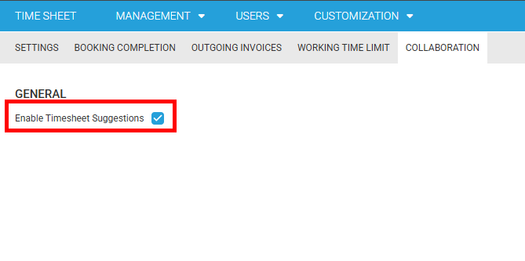
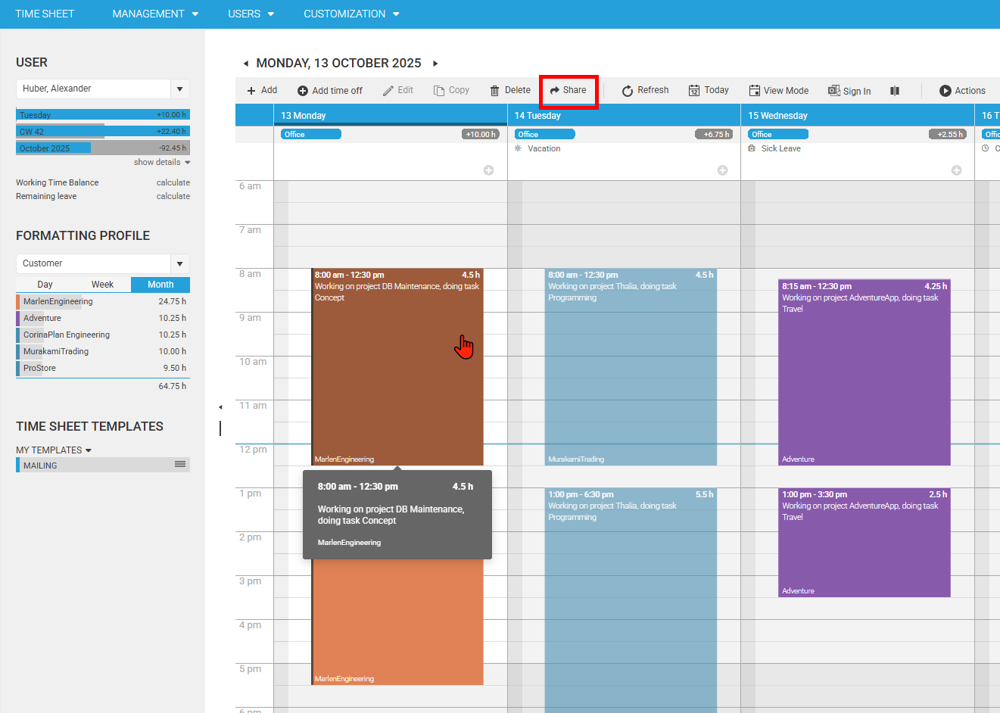
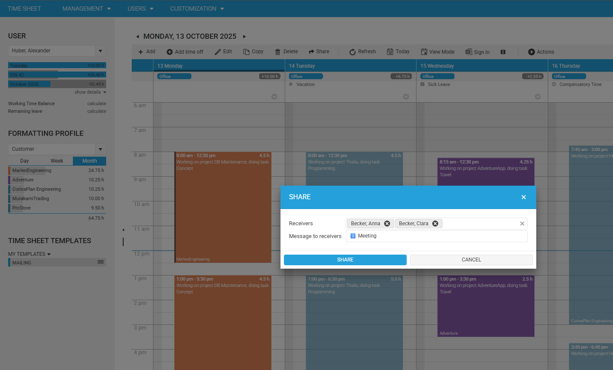
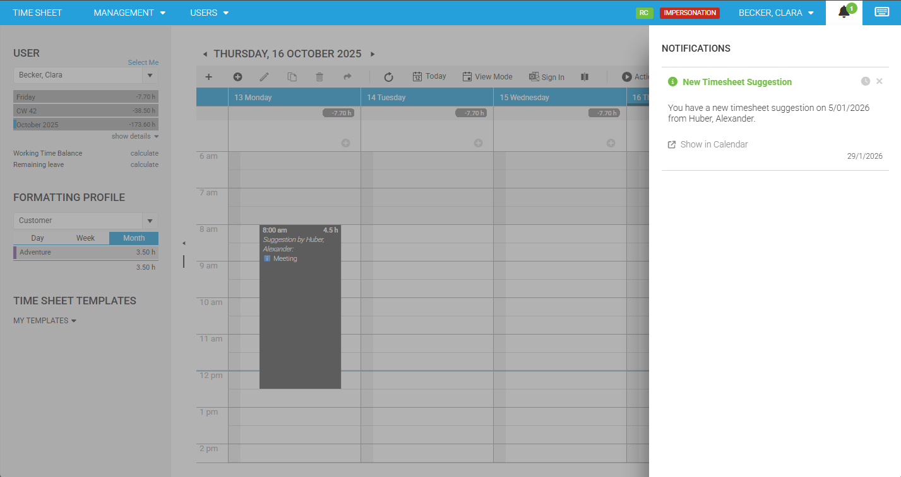
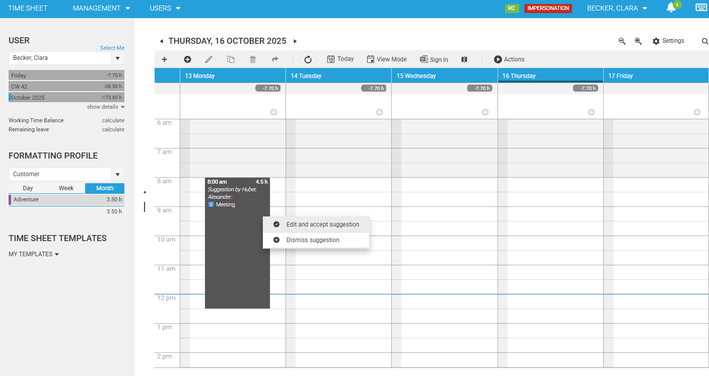

# Timesheet Suggestions / Share Timesheet

Time cockpit includes a **Timesheet Suggestions** feature that lets you **share one or more existing timesheet entries** with other users.
The shared items appear for the receiver as **suggestions** in the Timesheet Calendar. The receiver can then **accept** a suggestion (which creates a new timesheet entry based on the shared template) or **dismiss** it.

## Use case

A common scenario is:

- A consultant tracks time against a specific customer/project/task.
- A colleague worked on the same work package and should book time similarly, but is unsure about the correct scope, description, or duration.
- Instead of sending a long explanation by chat/email, the consultant **shares an existing timesheet entry** as a suggestion.
- The colleague reviews it directly in the calendar and **accepts** it (optionally editing details before saving).

This helps teams standardize bookings and reduces back-and-forth.

## Overview

Timesheet Suggestions consists of two parts:

- **Share**: A sender shares selected timesheet entries to one or more receivers with a short message.
- **Review**: Receivers see suggestions in their Timesheet Calendar and can either:
  - **Edit & accept** (creates a new timesheet entry based on the suggestion)
  - **Dismiss** (marks the suggestion as dismissed)

Suggestions are stored as records in `APP_TimesheetSuggestion` and include a serialized snapshot of the original timesheet entry plus sender/receiver, message, and time range.

## Key functionalities

### Share selected timesheet entries

- Share action is available in the Timesheet Calendar toolbar when the feature is enabled.
- You can share **multiple selected** timesheet entries in one go.
- You must provide:
  - **Receivers** (one or more enabled, non-hidden users; you cannot select yourself)
  - **Message to receivers** (required; max length 100)

### Suggestions appear as calendar items

- Suggestions are shown in the receiver’s Timesheet Calendar for the matching time range.
- They are shown as **read-only** items with the sender and message (e.g. “Suggestion by …”).

### Accepting a suggestion

- The receiver can choose **Edit and accept suggestion**.
- Time cockpit opens the normal timesheet entry form with **pre-filled values** from the shared entry.
- After the receiver saves the entry, the suggestion is marked as **accepted**.

### Dismissing a suggestion

- The receiver can choose **Dismiss suggestion**.
- A confirmation dialog is shown.
- The suggestion is marked as **dismissed**.

### Notifications (if supported by the tenant)

If your tenant supports system notifications and Timesheet Suggestions is enabled, time cockpit adds a dedicated notification provider for timesheet suggestions.
Depending on your notification setup, new suggestions may also show up in your notifications (bell icon).

## Prerequisites & dependencies

To use Share Timesheet / Timesheet Suggestions, all of the following must be true:

1. **Enabled in Global Settings**
   - Global Settings flag: `Enable Timesheet Suggestions` must be `true`.
2. **Access to Timesheet Calendar**
   - Users must have permission to view/create timesheets in the Timesheet Calendar.

> [!NOTE]
> If the feature is not installed or not enabled, the Share button and related UI won’t be available.

## Enable Timesheet Suggestions (Global Settings)

1. Open **Global Settings**:
   - Typical URL: https://web.timecockpit.com/app/forms/entity/APP_GlobalSettings
2. Locate the setting **Enable Timesheet Suggestions** (technical name `APP_TimesheetSuggestionsEnabled`).
3. Set it to **enabled/true**.
4. Refresh the web app.

> [!TIP]
> If you don’t see the setting in the Global Settings form, it may not be included in your current Global Settings UI customization.
> In that case you’ll need to add the `APP_TimesheetSuggestionsEnabled` property to your Global Settings form customization.

## How to use the feature

### Share a timesheet entry (sender)

1. Open the **Timesheet Calendar**.
2. Select one or more existing timesheet entries.
3. Use one of these options:
   - Click **Share** in the toolbar (share icon).
   - Use the context menu item **Share**.
   - Keyboard shortcut: `Ctrl + M`.

   

4. In the Share dialog:
   - Choose one or more **Receivers**.
   - Enter a **Message to receivers**.
5. Confirm **Share**.

After sharing, time cockpit shows a confirmation notification like:

- “Timesheet entry \"…\" has been shared.”

If notifications are enabled in your tenant, receivers may also get a notification about the new suggestion.

### Review suggestions (receiver)

1. Open the **Timesheet Calendar**.
2. Navigate to the day/week that contains the suggested time range.
3. Suggestions appear as calendar items that include the sender and the message.

### Accept (create a real timesheet entry)

1. Click the suggestion item.
2. Choose **Edit and accept suggestion** (or just double-click the suggestion).
3. Review and adjust the pre-filled values as needed.
4. Save the timesheet entry.

The suggestion is then marked as accepted and will no longer be shown as an open suggestion.

### Dismiss

1. Click the suggestion item.
2. Choose **Dismiss suggestion**.
3. Confirm the dialog.

The suggestion is marked as dismissed and will no longer be shown as an open suggestion.

## Notes & limitations

- Suggestions are shown only if they are **not accepted and not dismissed**.
- Suggestions are loaded for the **currently selected user** and the **currently visible date range** in the calendar.
- The receiver list includes users that are enabled and not hidden, excluding the current user.
- Message length is limited to **100 characters**.
