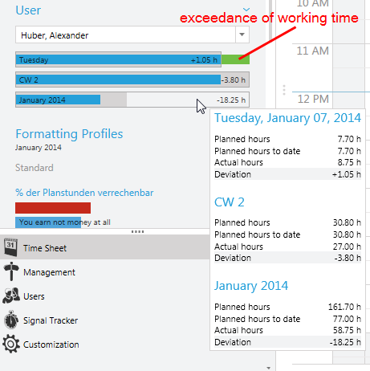
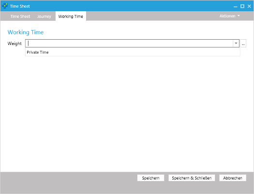

# Working Time	

The working time display shows the planned hours of work and actual actual hours of work for the

- current day,
- current week and
- current month.

## Determining of planned and actual hours of work
In the chapters [planned hours of work](~/doc/employee-time-tracking/working-time.md#planned-hours-of-work) and [actual hours of work](~/doc/employee-time-tracking/working-time.md#actual-hours-of-work) you find detailed information on how the time, which is shown in the working time display, are determined.

> [!NOTE]
In this documentation you find a sample script which shows, how you can [integrate holidays automatically for a given year](~/doc/scripting/add-holidays.md). This sample contains all common holidays. You may adapt them to your concrete needs.

## Private Time Sheet Entries

> [!WARNING]
Please consider that all versions after time cockpit 1.7 do not support hiding time sheets entries via the [TCQL expression](~/doc/tcql/expression-language.md) configured in the options dialogue anymore. This function has been replaced by the significantly more powerful solution of working time weight (see chapter [actual hours of work](~/doc/employee-time-tracking/working-time.md#actual-hours-of-work)). If you use the old function of private time sheet entries, a warning will appear if you start time cockpit for first time which will indicate to use working time weight in the future.

In time cockpit cockpit you have the possibility to enter private time sheet entries, which won’t be included in the actual hours of work (e.g. times for advanced training, travelling time without consideration to actual hours of work, etc.). If you want to use private time sheet entries, create a working time weight with 0 % (see chapter [actual hours of work](~/doc/employee-time-tracking/working-time.md#actual-hours-of-work)).

If you want to include e.g. times you spend at the University for further education but don’t want them considered in the actual hours of work, assign the working time weight with 0 % to the time sheet entries.

