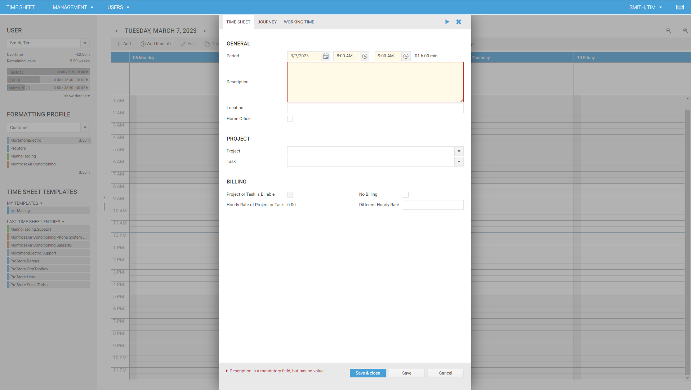
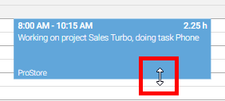
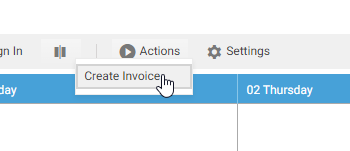

# Working With Time Sheet Entries

## Create

You can create time sheet entries in a number of ways:

- Double-click at the point in the calendar where your time sheet entry should begin. The time sheet entry form will be opened. The default begin time is the time you clicked.
- Click on **+ Add** in the toolbar of the graphical calendar.
- Press **CTRL + I**.
- Double-click a Microsoft Office Outlook appointment (see [Microsoft Office Outlook appointments](outlook-appointments.md)).
- Copy an existing time sheet entry.
<!-- - Double-click an area in the signals (see [signals](signals.md)). -->

Whichever way you choose, you will get the form for a new time sheet. To save the time sheet entry, click **Save** or hit **Ctrl + Enter** on the key board to save the time sheet entry. 

In the standard configuration of time cockpit, you have to enter a description. Additionally, we provide fields like location, home office, project, task etc.

> [!NOTE] 
If the standard properties do not work for your business let us know at support@timecockpit.com. With time cockpit's customization capabilities, you can add your own properties, forms, lists etc. to integrate it into your organizational structure and processes to streamline your work. To get an overview of time cockpit's time cockpit's customization capabilities please refer to [Data Model Customization](~/doc/data-model-customization/overview.md)

## Change

You can change time sheet entries the following ways:

- Double-click the time sheet entry that you want to change and change the start and end time
- Select a time sheet entry by clicking on it and click **Edit** booking in the toolbar.
- Select a time sheet entry and click the right mouse button and select **Edit** from the context menu.

The color and text of a time sheet entry in the calendar depend on your selected formatting profile. You can find more information on how you can configure your time sheet entries at [Formatting Profiles](formatting-profiles.md).

You can change all details of a time sheet entry in the time sheet entry form. Begin and end time can also be modified in the time sheet calendar with the mouse. To change the begin or end time move the mouse pointer over the upper or lower border or the time sheet entry, click it, hold the mouse button pressed and move the mouse. 

To move a time sheet entry click the time sheet entry, hold the mouse button pressed and move the mouse.

> [!NOTE]
In the week view you can move or copy time sheet entries from one day to another by drag & drop.

## Copy

You cannot only move time sheet entries but also copy them with the mouse. Proceed exactly as described in moving time sheet entries but additionally press the CTRL key. A small + sign will be displayed next to the mouse pointer. When you release the mouse button (keep CTRL pressed) the time sheet entry will be copied to the specified time.

## Delete

You can delete time sheet entries by the following ways:

- Select a time sheet entry by clicking on it and press the DEL key.
- Select a time sheet entry by clicking on it and click on **Delete** booking in the toolbar.
- Select a time sheet entry and click the right mouse button and select **Delete** from the context menu.

## Actions in the Time Sheet Calendar

If you have reoccurring tasks that you want to accomplish in the time sheet calendar, you can create actions in time cockpit. Learn how to build a new action at [Actions](~/doc/scripting/actions.md). If the action does not need an input set, the action is always available. If the action takes one or more time sheet entries as input set, you can only call the action if you have selected one or more time sheet entries in the calendar.

