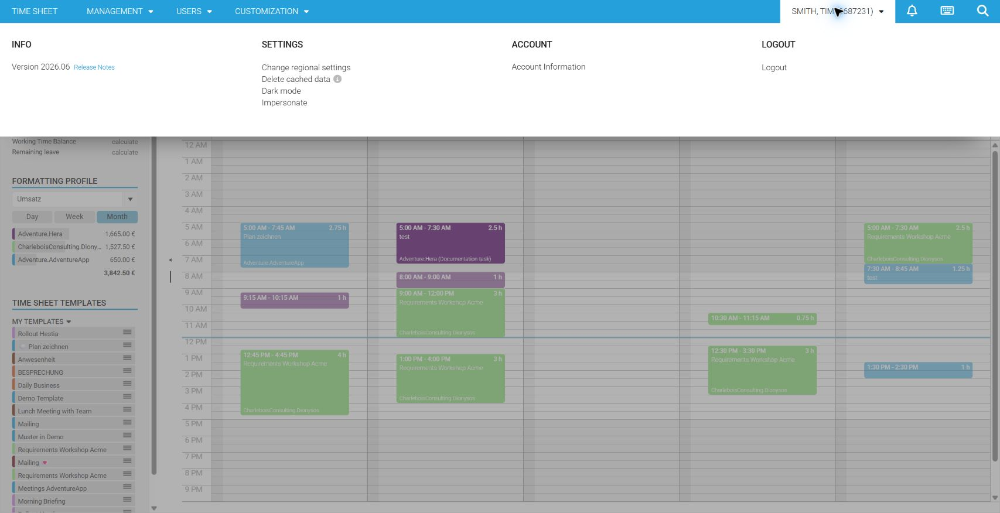
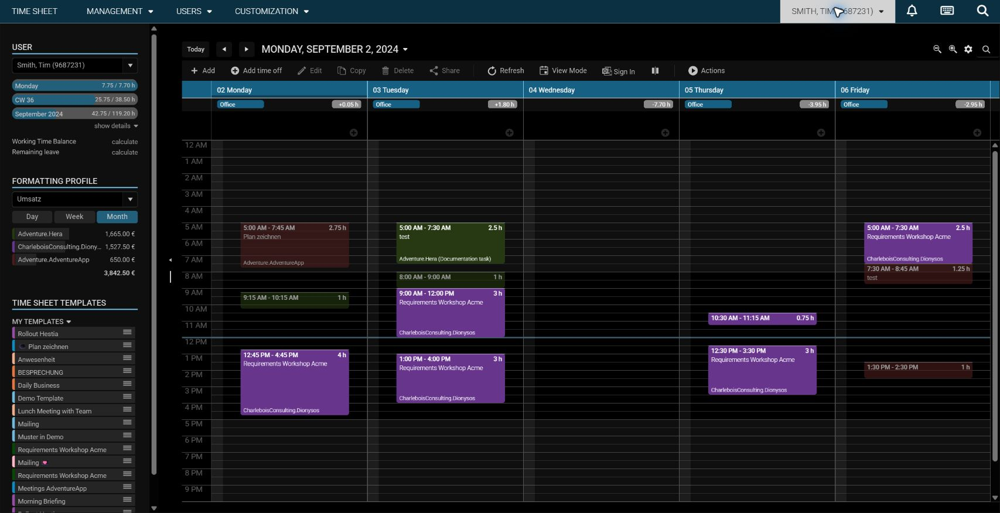

# Dark Mode in time cockpit

Dark mode changes the time cockpit web client to a dark color theme. It can reduce glare in low-light environments and provides a consistent dark appearance across the timesheet calendar, lists, forms, and dashboards.

## Enable dark mode

1. Open the **user menu** by selecting your name in the upper-right corner.
2. In the **Settings** section, select **Dark mode**.
3. The web client applies the dark theme immediately.

The following example shows the timesheet calendar with dark mode enabled:

## Switch back to light mode

Open the user menu again and select **Dark mode** to clear the setting. The web client immediately returns to the light theme.

> [!TIP]
> Dark mode changes the appearance only. It does not change your calendar data, list configuration, dashboards, or permissions.

Dark mode was introduced with the [June 2026 release](../release-notes/2026-06.md).
