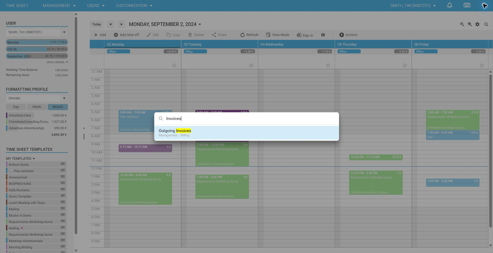

# Search the Navigation Menu in time cockpit

The global menu search helps you find lists, forms, and modules without opening each level of the navigation hierarchy. Results are filtered while you type and show the menu path so that similarly named entries are easier to identify.

## Open the menu search

Use either of these methods:

- Select the **search** icon in the upper-right corner of the web client.
- Press **Ctrl+Shift+P**.

The search dialog can be opened from anywhere in the web client.

## Find a menu item

1. Open the menu search.
2. Enter all or part of the name of a list, form, or module.
3. Review the matching result and its navigation path.
4. Select the result to open it.

For example, searching for `Invoices` finds **Outgoing Invoices** and displays its location under **Management > Billing**.

Press **Esc** to close the search without opening a result.

## Search tips

- Search for the visible menu item name, such as `Customers`, `Projects`, or `Invoices`.
- Use a distinctive part of a longer name if you do not remember its full wording.
- Check the displayed menu path when multiple results have similar names.
- Search results respect the menu entries and permissions available to your user account.

Menu search was introduced with the [June 2026 release](../release-notes/2026-06.md).
