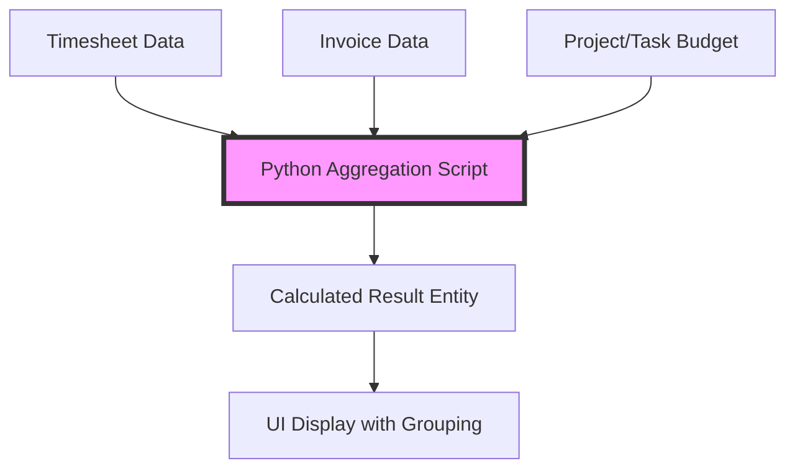

# Budgetary Control of Projects and Tasks

Time cockpit provides powerful built-in lists for real-time project profitability analysis. These lists combine timesheet and invoice data to give you comprehensive budget tracking.

## Overview

The budgetary control functionality consists of two main lists:
- **[Budgetary Control of Projects](https://web.timecockpit.com/app/lists/APP_BudgetaryControlOfProjectsList)**: Project-level budget analysis
- **[Budgetary Control of Tasks](https://web.timecockpit.com/app/lists/APP_BudgetaryControlOfTasksList)**: Task-level budget analysis

Both lists are implemented as **custom Python scripts** that aggregate data from multiple sources and calculate derived metrics in real-time.

## Key Metrics Explained

### From Timesheet Data

#### Hours
```python
.Hours = Sum(T.DurationInHours)
```
Total hours logged across all timesheets for the project, regardless of billability.

#### Billable Hours
```python
.HoursBillable = Sum(:Iif(T.APP_Billable = True And T.HourlyRateActual > 0, T.DurationInHours, 0))
```
Only counts hours that are:
- Marked as billable (`APP_Billable = True`)
- Have an actual hourly rate greater than 0

**Why this matters**: You may have timesheets on billable projects that aren't themselves billable (internal meetings, setup time, etc.)

#### Budget in Hours
```python
.BudgetInHours = :Iif(
    :Iif(T.Project = Null, T.Task.Project.BudgetInHours, T.Project.BudgetInHours) = Null 
    And :Iif(T.Project = Null, T.Task.Project.HourlyRateActual, T.Project.HourlyRateActual) <> 0,
    :Iif(T.Project = Null, T.Task.Project.Budget, T.Project.Budget) / 
    :Iif(T.Project = Null, T.Task.Project.HourlyRateActual, T.Project.HourlyRateActual),
    :Iif(T.Project = Null, T.Task.Project.BudgetInHours, T.Project.BudgetInHours)
)
```
This derives hours from budget amount if `BudgetInHours` isn't directly set:
- If project has `Budget` (amount) but no `BudgetInHours`, calculates: `Budget / HourlyRate`
- Otherwise uses `BudgetInHours` directly

#### Progress Percentage
```python
.ProgressBillablePercent = newEntry.HoursBillable / newEntry.BudgetInHours if newEntry.BudgetInHours > 0 else 0
.ProgressPercent = newEntry.Hours / newEntry.BudgetInHours if newEntry.BudgetInHours > 0 else 0
```
Two metrics:
- **ProgressBillablePercent**: What % of budgeted hours are billable hours?
- **ProgressPercent**: What % of budgeted hours are total hours? (including non-billable)

#### Revenue
```python
.Revenue = Sum(T.Revenue)
```
Sum of all timesheet revenue. Each timesheet's revenue is calculated as:
```tcql
T.APP_Revenue = T.APP_DurationInHours * T.APP_HourlyRateActual
```

#### Unbilled Revenue
```python
.RevenueNotBilled = Sum(:Iif(T.APP_Billed = True Or T.APP_Billable = False, 0, T.Revenue))
```
Revenue from timesheets that are:
- Billable (`APP_Billable = True`)
- Not yet billed (`APP_Billed = False`)

#### Costs
```python
.Costs = Sum(T.DurationInHours * T.UserDetail.APP_HourlyRate)
```
Internal cost calculation using **employee's internal hourly rate** (not the billed rate). This shows your actual labor cost.

#### Effective Hourly Rate
```python
.EffectiveHourlyRate = Sum(T.Revenue) / Sum(T.DurationInHours)
```
Average revenue per hour worked. Useful for comparing against project's planned hourly rate.

**Example**: 
- Planned rate: €100/hour
- Effective rate: €85/hour
- → Some hours were non-billable or discounted

### From Invoice Data (Cross-Reference)

The list performs **separate queries** against invoices to cross-validate:

#### Billed Revenue from Invoices
```python
invoiceQuery = '''
    From I In APP_Invoice
    Where (@Project = Null Or I.Project.ProjectUuid = @Project)
    Select New With {
        .ProjectUuid = I.Project.ProjectUuid,
        .InvoiceRevenue = Sum(I.ReadOnlyRevenue)
    }
'''
```
This is the **actual invoiced amount** - what you've billed the customer.

**Why separate from timesheet revenue?**
- Invoices might include fixed-price items, expenses, or articles
- Invoices might have discounts applied
- Invoiced amount ≠ sum of timesheet revenue

#### Billed Hours from Invoices
```python
invoiceDetailQuery = '''
    From I In APP_InvoiceDetail
    Where (I.Unit.Code = "hour")
    Select New With {
        .ProjectUuid = I.Invoice.Project.ProjectUuid,
        .InvoicedHours = Sum(I.Quantity)
    }
'''
```
Only counts invoice details where the unit is "hour" (not lump-sum items).

#### Unbilled Hours from Invoices
```python
.UnbilledHoursFromInvoices = newEntry.BudgetInHours - newEntry.BilledHoursFromInvoices
```
Remaining hours in budget that haven't been invoiced yet.

**Warning**: This can be negative if you've invoiced more than budgeted!

## Data Flow & Architecture



### Processing Steps

1. **Filter Timesheets**: Apply user's filter parameters (customer, project, dates, closed projects)
2. **Apply Permissions**: Filter by user's roles (BillingAdmin, ProjectController, ProjectManager)
3. **Aggregate Timesheet Data**: Group by project, calculate hours, revenue, costs
4. **Query Invoices Separately**: Get invoiced amounts and hours
5. **Cross-Reference**: Match invoice data to projects by UUID
6. **Build Result Objects**: Create in-memory entity objects with all calculated fields
7. **Return to UI**: Display with grouping, sorting, and formatting

### Permission Enforcement

**Important**: These lists respect default permissions:

```python
if defaultPermissionsEnabled == True:
    whereCondExt = '''
        And :Iif('BillingAdmin' In Set('CurrentUserRoles') Or
                 'ProjectController' In Set('CurrentUserRoles') Or
                 ('ProjectManager' In Set('CurrentUserRoles') And 
                  (T.APP_Project.APP_Manager1 = Environment.CurrentUser.UserDetailUuid Or 
                   T.APP_Project.APP_Manager2 = Environment.CurrentUser.UserDetailUuid)),
                 True, False) = True
    '''
```

**Access is limited to**:
- Users with `BillingAdmin` role: See all projects
- Users with `ProjectController` role: See all projects  
- Users with `ProjectManager` role: See only projects where they are Manager1 or Manager2

Regular users won't see these lists in the navigation.

## Complete TCQL Query Breakdown

### Main Timesheet Query

```python
timesheetQuery = '''
From T In Timesheet.Include('Task.Project.Customer').Include('Project.Customer')
Where
    (@IncludeClosed = True Or (T.Task <> Null And T.Task.Project.Closed = False) Or T.Project.Closed = False)
    And (@IncludeUnbillable = True Or T.Task.Project.Billable = True Or T.Project.Billable = True)
    And (@Customer = Null Or T.Task.Project.Customer.CustomerUuid = @Customer Or T.Project.Customer.CustomerUuid = @Customer)
    And (@Project = Null Or T.Task.Project.ProjectUuid = @Project Or T.Project.ProjectUuid = @Project)
    -- + permission filter if enabled
Order By :Iif(T.Project = Null, :DisplayValue(T.Task.Project.Customer), :DisplayValue(T.Project.Customer))
Select New With {
    .CustomerName = :Iif(T.Project = Null, :DisplayValue(T.Task.Project.Customer), :DisplayValue(T.Project.Customer)),
    .CustomerUuid = :Iif(T.Project = Null, T.Task.Project.Customer.CustomerUuid, T.Project.Customer.CustomerUuid),
    .ProjectName = :Iif(T.Project = Null, :DisplayValue(T.Task.Project), :DisplayValue(T.Project)),
    .ProjectUuid = :Iif(T.Project = Null, T.Task.Project.ProjectUuid, T.Project.ProjectUuid),
    .Billable = :Iif(T.Project = Null, T.Task.Project.Billable, T.Project.Billable),
    .FixedPrice = :Iif(T.Project = Null, T.Task.Project.FixedPrice, T.Project.FixedPrice),
    .Hours = Sum(T.DurationInHours),
    .HoursBillable = Sum(:Iif(T.APP_Billable = True And T.HourlyRateActual > 0, T.DurationInHours, 0)),
    .Budget = [complex calculation - see "Budget in Hours" above],
    .BudgetInHours = [see above],
    .Costs = Sum(T.DurationInHours * T.UserDetail.APP_HourlyRate),
    .Revenue = Sum(T.Revenue),
    .HoursNotBilled = Sum(:Iif(:Iif(T.Project = Null, T.Task.Project.Billable, T.Project.Billable) = True,
                              :Iif(T.APP_Billed = True Or T.APP_Billable = False Or T.APP_HourlyRateActual = 0, 0, T.DurationInHours),
                              Null)),
    .RevenueNotBilled = Sum(:Iif(T.APP_Billed = True Or T.APP_Billable = False, 0, T.Revenue)),
    .EffectiveHourlyRate = Sum(:Iif(:Iif(T.Project = Null, T.Task.Project.Billable, T.Project.Billable) = True,
                                     T.Revenue, Null)) / Sum(T.DurationInHours)
}
'''
```

**Key patterns**:
- **Task vs. Project handling**: `T.Project = Null` checks if timesheet is assigned to task (then use `T.Task.Project`) or directly to project
- **Grouping**: Automatically groups by project (and customer for ordering)
- **Conditional sums**: Uses `:Iif()` extensively to conditionally include values

## Building Your Own Custom Aggregation List

Want to create a similar report? Here's the pattern:

### 1. Define Result Entity

```python
def getResultModelEntity(context):
    entity = ModelEntity({ "Name": "Result" })
    entity.Properties.Add(TextProperty({ "Name": "ProjectName" }))
    entity.Properties.Add(GuidProperty({ "Name": "ProjectUuid" }))
    entity.Properties.Add(NumericProperty({ "Name": "Revenue" }))
    entity.Properties.Add(NumericProperty({ "Name": "Costs" }))
    entity.Properties.Add(NumericProperty({ "Name": "Margin" }))
    return entity
```

### 2. Create Query Function

```python
def getItems(context, queryParameters):
    dc = context
    resultEntity = getResultModelEntity(context)
    
    # Query your data
    data = dc.SelectWithParams({
        "Query": "From T In APP_Timesheet Where ... Select ...",
        "QueryParameters": queryParameters
    })
    
    # Build result objects
    result = List[EntityObject]()
    for row in data:
        entry = resultEntity.CreateEntityObject()
        entry.ProjectName = row.ProjectName
        entry.Revenue = row.Revenue
        entry.Costs = row.Costs  
        entry.Margin = row.Revenue - row.Costs
        result.Add(entry)
    
    return result.Cast[EntityObject]().ToArray()
```

### 3. Create List Configuration

```xml
<List AllowDelete="False" ExecuteOnOpen="False" AllowEdit="True"
      EditModelEntityName="APP_Project" EditProperty="ProjectUuid"
      xmlns="clr-namespace:TimeCockpit.Data.DataModel.View;assembly=TimeCockpit.Data">
    
    <List.ScriptSource>
        <sys:String xml:space="preserve">
            [Your Python script here]
        </sys:String>
    </List.ScriptSource>
    
    <List.Groups>
        <Group AutoExpand="True" MemberPath="CustomerName" SortDirection="Ascending" />
    </List.Groups>
    
    <List.Filter>
        <!-- Add filter parameters -->
    </List.Filter>
    
    <!-- Column definitions -->
    <BoundCell Content="=Current.ProjectName" Header="Project" />
    <NumericCell Content="=Current.Revenue" Header="Revenue" NumberFormatPattern="#,##0.00" />
    <!-- ... more columns ... -->
</List>
```

## Performance Considerations

The budgetary control lists can be slow for large datasets because they:
1. Query all timesheets (potentially thousands)
2. Query all invoices separately  
3. Perform grouping and calculations in Python
4. Build result objects in memory

**Optimization tips**:
- Always use filters (customer, project, date range) to limit data
- Consider pre-calculating summary values in nightly batch jobs
- For very large tenants, create materialized views or cache results

## Common Questions

### Why don't revenue numbers match?

**Timesheet Revenue** vs. **Invoice Revenue** can differ because:
- Invoices may include non-timesheet items (expenses, articles, fixed fees)
- Invoices may have discounts or adjustments
- Timesheets might not all be billed yet
- Exchange rate differences for international invoices

**Always check both!**

### Can I add custom columns?

Yes! Modify the Python script:
1. Add property to `getResultModelEntity()`
2. Calculate value in `getItems()`
3. Add `<BoundCell>` or `<NumericCell>` to XML

Example - add profit margin %:
```python
# In getResultModelEntity:
entity.Properties.Add(NumericProperty({ "Name": "MarginPercent" }))

# In getItems:
entry.MarginPercent = (entry.Revenue - entry.Costs) / entry.Revenue * 100 if entry.Revenue > 0 else 0

# In XML:
<NumericCell Content="=Current.MarginPercent" Header="Margin %" NumberFormatPattern="#,##0.0 '%'" />
```

### Can I export this data via API?

Not directly - these are **runtime-calculated lists**, not stored data. 

**Options**:
1. **Recreate the logic** in your external script using Web API queries
2. **Export from UI** using Excel export button
3. **Create a scheduled report** that emails results daily

## Related Documentation

- [APP_Project Entity Reference](../data-model/standard-entities.md#app_project)
- [APP_Timesheet Entity Reference](../data-model/standard-entities.md#app_timesheet)
- [APP_Invoice Entity Reference](../data-model/standard-entities.md#app_invoice)
- [Custom Lists Guide](../data-model-customization/list.md)
- [TCQL Overview](../tcql/overview.md)
- [Scripting Overview](../scripting/overview.md)

## See Also

- **Similar Use Case**: [Target vs. Actual Hours Comparison](https://web.timecockpit.com/app/lists/APP_TargetActualHoursComparisonList)
- **Related List**: [Unbilled Timesheets](https://web.timecockpit.com/app/lists/APP_UnbilledTimesheetsList)
- **API Alternative**: [Query Endpoint Examples](../web-api/query.md)
