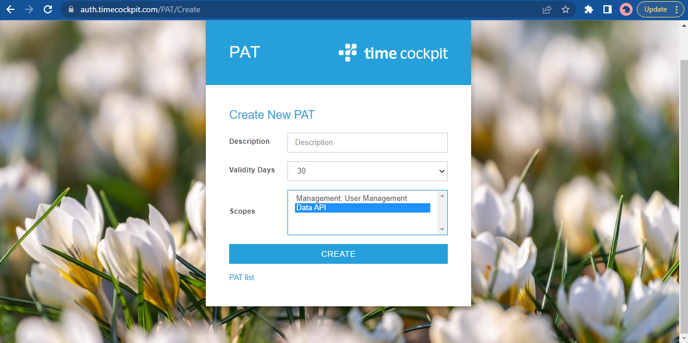

# Authentication

Three forms of authentication are currently supported:

- [Token authentication](http://en.wikipedia.org/wiki/Access_token) offers a simple and efficient way to authenticate web requests. A header is used to transfer the access token and identify the bearer.
- [Basic authentication](http://en.wikipedia.org/wiki/Basic_access_authentication) with username and password is used by tools that do not offer token authentication (e.g. [OData in Excel](http://office.microsoft.com/en-001/excel-help/connect-to-an-odata-feed-HA104019824.aspx)) and to initially acquire authentication tokens.
- [PAT authentication](https://en.wikipedia.org/wiki/Personal_access_token).

> [!WARNING]
We strongly discourage to use token or basic authentication. These methods of authentication will be disabled in the foreseeable future. We strongly recommend authenticating using PATs.

### Acquire PAT

To acquire a PAT follow these steps:

1. Navigate to https://auth.timecockpit.com/pat
2. Provide your time cockpit username or password
3. Click "Create new PAT" to create a new PAT for your user
4. Enter a description, the validity and select the scope of the PAT. We distinguish between two different scopes:
   1. Management: Allows you to programmatically create and disable users via the Web API
   2. Data: Allows you to manage all data in your account. If you have permissions in your tenant, you get the same permissions with the PAT as your user already has.

5. Click "Create" and you are presented with the generated PAT. Copy the PAT to a save location e.g. a password safe.

### Authenticate using a PAT

The following snippet shows how to set up a time cockpit Http client in an Azure Function

```cs
[assembly: FunctionsStartup(typeof(Startup))]

namespace ImportExportFunctionApp;

public class Startup : FunctionsStartup
{
	public override void Configure(IFunctionsHostBuilder builder)
	{
		builder.Services.AddLogging();
		ConfigureCommonServices(builder);
	}

	#region Helpers

	public virtual void ConfigureCommonServices(IFunctionsHostBuilder builder)
	{
		var context = builder.GetContext();
		var config = context.Configuration;

		builder.Services.AddLogging();

		ConfigureTimeCockpitHttpClient(builder.Services, config);
	}

	public virtual void ConfigureTimeCockpitHttpClient(IServiceCollection services, IConfiguration config)
	{
		services.AddHttpClient("TimeCockpit", httpClient =>
		{
			httpClient.BaseAddress = new Uri(config["TimeCockpitBaseUri"]);
			httpClient.DefaultRequestHeaders.Authorization = new AuthenticationHeaderValue($"Bearer", $"{config["TimeCockpitDataApiPAT"]}");
		});
	}

	#endregion
}
```

> [!NOTE]
We strongly discourage to store the PAT in source code, but to persist sensitive information in e.g. Microsoft Key Vault

### Query Metadata

The following sample shows how to query time cockpit metadata using a PAT:

```cs
var metadataUri = "https://api.timecockpit.com/odata/$metadata";

using (var httpClient = new HttpClient())
{
	httpClient.BaseAddress = new Uri(timeCockpitBaseUri);
	httpClient.DefaultRequestHeaders.Authorization = new AuthenticationHeaderValue($"Bearer", timeCockpitDataApiPAT);

	var response = await httpClient.GetAsync(metadataUri);
	response.EnsureSuccessStatusCode();

	var metadata = await response.Content.ReadAsStringAsync();
}
```

### Metadata Request

```
GET https://api.timecockpit.com/odata/$metadata HTTP/1.1
Authorization: Bearer YOUR_PAT
Host: api.timecockpit.com
```

### Metadata Response

```

HTTP/1.1 200 OK
Content-Length: 2403124
Content-Type: application/xml; charset=utf-8
Server: Microsoft-IIS/10.0
DataServiceVersion: 3.0
X-Powered-By: ASP.NET
Date: Tue, 04 Apr 2023 15:34:22 GMT
Access-Control-Expose-Headers: Request-Context
Request-Context: appId=cid-v1:84a13eca-1545-488e-8dd4-a46a0272dff1

<?xml version="1.0" encoding="utf-8"?>
<edmx:Edmx Version="1.0" xmlns:edmx="http://schemas.microsoft.com/ado/2007/06/edmx">
  <edmx:DataServices m:DataServiceVersion="3.0" xmlns:m="http://schemas.microsoft.com/ado/2007/08/dataservices/metadata">
    <Schema Namespace="cofx" xmlns="http://schemas.microsoft.com/ado/2009/11/edm">
      <EntityType Name="APP_CompensatoryTime">
        <Key>
          <PropertyRef Name="APP_CompensatoryTimeUuid" />
        </Key>
        <Property Name="APP_CompensatoryTimeUuid" Type="Edm.Guid" Nullable="false" />
        <Property Name="APP_BeginTime" Type="Edm.DateTime" />
        <Property Name="APP_Description" Type="Edm.String" />
        <Property Name="APP_DurationInHours" Type="Edm.Decimal" />
        <Property Name="APP_EndTime" Type="Edm.DateTime" />
        <Property Name="APP_IsWholeDay" Type="Edm.Boolean" />
        <Property Name="APP_UserDetailUuid" Type="Edm.Guid" />
        <NavigationProperty Name="APP_UserDetail" Relationship="cofx.cofx_APP__CompensatoryTime_APP__UserDetail_cofx_APP__UserDetail_UserDetailsOfCompensatoryTime" ToRole="APP_UserDetail" FromRole="UserDetailsOfCompensatoryTime" />
      </EntityType>
      ...
</edmx:Edmx>
```
