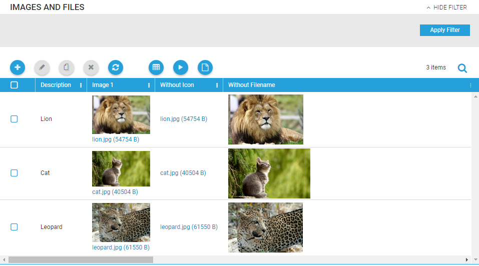
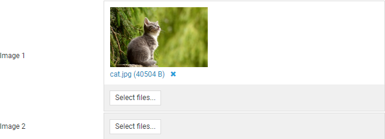
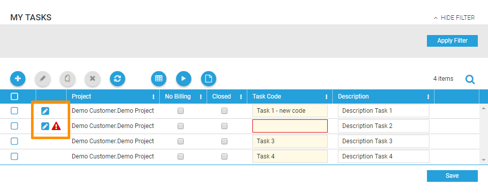
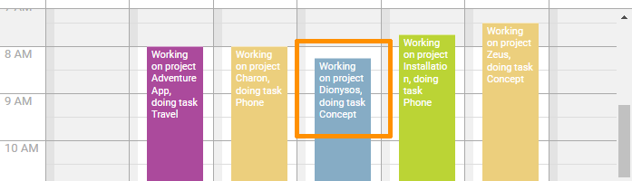
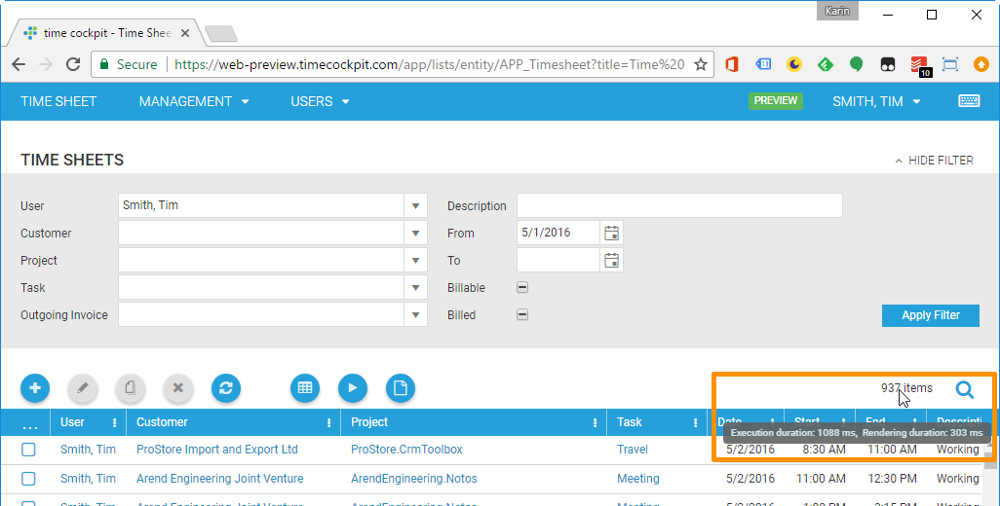

# June 2017

[!include[only in preview](../only-in-preview-available.md)]

## FileCell in Lists and Forms

In the new version of the web client, displaying and editing of files is supported. To show files and images, you will need a <xref:TimeCockpit.Data.DataModel.FileProperty> in your data model. File Properties cannot be created in the customization area of the full client at the moment. Instead, you must create them via script. Read more at [How To: Add a File Properties](../doc/scripting/add-file-property.md).

Once you have added a <xref:TimeCockpit.Data.DataModel.FileProperty> to a <xref:TimeCockpit.Data.DataModel.ModelEntity>, you can simply use it in lists with a <xref:TimeCockpit.Data.DataModel.View.BoundCell>. To get more options on how the file or image is displayed, you can also use the <xref:TimeCockpit.Data.DataModel.View.FileCell>:

```
<FileCell Content="=Current.USR_Image1" ShowIcon="False" Header="Without Icon" />
```



In forms, there is a button "Select files..." which allows you to upload new files. Alternatively, you can drag and drop a file over the gray area of the button to upload it. The icon on the right side of the file name allows you to delete the file.



## Editable Lists

This month, our first version of editable lists is available in the web client. They allow you to edit and save all rows in a list at the same time.

Editable lists must have set `EditMode="AllRows"` in the list definition:

```
<List AllowDelete="True" AllowEdit="True" EditMode="AllRows" xmlns="clr-namespace:TimeCockpit.Data.DataModel.View;assembly=TimeCockpit.Data">
```

Additionally, each column that should be editable must have set the IsReadOnly flag:

```
<BoundCell Content="=Current.USR_Description" IsReadOnly="False" />
```

The second column in editable lists shows status indicators for the row. The pencil indicates, that the row has been edited. The exclamation mark shows, that the row cannot be saved because of an error. Move the mouse cursor over the icon to show the error text. Additionally, the error text will be displayed when you try to save the list.



## Performance Improvements in Time Sheet Calendar

### Zooming Improvements

To improve the performance when zooming, we have changed the way texts are displayed in the calendar. Now, we can display multi line descriptions just as in the full client.



During zooming the texts are hidden to make zooming faster.

### Copy / Resize Improvements

Until now, the complete time sheet calendar was locked during save of a time sheet item. In the new version, we only show an asterisk to the left of the description of a moved or resized item. Additionally, you will find a message in the bottom right corner that indicates that saving or loading a time sheet entry is currently in progress. In the mean time, you can continue to move and resize the edited and all other time sheet entries.


When copying a time sheet entry, the cloned item is displayed gray, because it can only be edited, when it was saved for the first time. But you can still edit other time sheet entries while the new item is saved.

## Badges for Environment and Sandbox

Last month we started to offer two new time cockpit environments: https://web-preview.timecockpit.com and https://web-dev.timecockpit.com ([read more about the new environments](http://www.timecockpit.com/blog/2017/05/09/Change-to-Our-Release-Cycle)). To make it easier to recognize your current environment, we have added badges for the DEV and PREVIEW environment to the menu:


Additionally, you may have a [sandbox environment](https://www.timecockpit.com/blog/2016/05/27/Playing-in-the-Sandbox) for testing changes in your data model. Sandbox environments are now also marked with a badge:


## Line Breaks in ValidationException and ScriptingException

When raising a <xref:TimeCockpit.Data.DataModel.ValidationException> or <xref:TimeCockpit.Data.DataModel.ScriptingException> within an action, the specified text will be shown to the user. In the new version of the web client `\n` or `\r\n` can be used to force a line break in the exception message.

```python
raise ScriptingException("The entered text is not valid.\nPlease enter another text.")
```

The exception message will now contain line breaks:


## Execution and Rendering Duration in Lists

A tooltip over the number of items right above lists shows the last execution and rendering duration:



## Bug Fixes

- Combo boxes could not be cleared with the clear icon on the right side in the web client when a default value was set.
- List and form definitions with `\n` or `\r\n` in the header of a column did not show the line break in the web client.
- <xref:TimeCockpit.Data.DataModel.View.ActionCell>s with empty content showed an arrow icon which should not be displayed when no content is available.
- Focus was not always set to first button in confirm and alert dialogs.
- Read-only time sheet entries cannot be deleted anymore in time sheet calendar.
- Read-only numeric values were not formatted correctly in forms.
- Busy indicator for forms is shown immediately after opening the form.
- Forms with <xref:TimeCockpit.Data.DataModel.View.BackReferenceTab>s or <xref:TimeCockpit.Data.DataModel.View.BackReferenceCell>s for which a user does not have permissions can now be opened, the <xref:TimeCockpit.Data.DataModel.View.BackReferenceTab> or <xref:TimeCockpit.Data.DataModel.View.BackReferenceCell> shows error text for the missing permission.
- Checkbox for selecting all rows was not displayed in the header row.
- Lookup list for combo boxes did not enable select button when an item was selected.