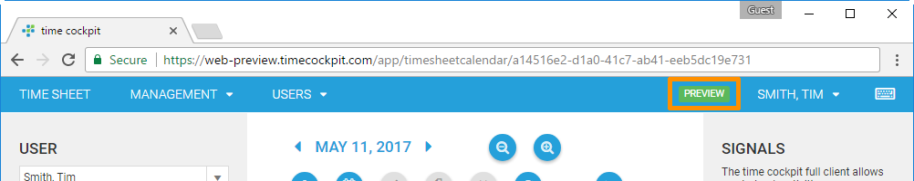

# June 2017

[!include[not available](../only-in-preview-available.md)]

## FileCell in Lists and Forms

[!include[not available](../not-available.md)]

## Editable Lists

[!include[not available](../not-available.md)]

## Badges for Environment and Sandbox

Last month we started to offer two new time cockpit environments: https://web-preview.timecockpit.com and https://web-dev.timecockpit.com ([read more about the new environments](http://www.timecockpit.com/blog/2017/05/09/Change-to-Our-Release-Cycle)). To make it easier to recognize your current environment, we have added badges for the DEV and PREVIEW environment to the menu:



Additionally, you may have a [sandbox environment](https://www.timecockpit.com/blog/2016/05/27/Playing-in-the-Sandbox) for testing changes in your data model. Sandbox environments are now also marked with a badge:


## Line Breaks in ValidationException and ScriptingException

When raising a <xref:TimeCockpit.Data.DataModel.ValidationException> or <xref:TimeCockpit.Data.DataModel.ScriptingException> within an action, the specified text will be shown to the user. In the new version of the web client `\n` or `\r\n` can be used to force a line break in the exception message.

```python
raise ScriptingException("The entered text is not valid.\nPlease enter another text.")
```

The exception message will now contain line breaks:


## Bug Fixes

- Combo boxes could not be cleared with the clear icon on the right side in the web client when a default value was set
- List definitions with `n` or `\r\n` in the header of a column did not work in the web client