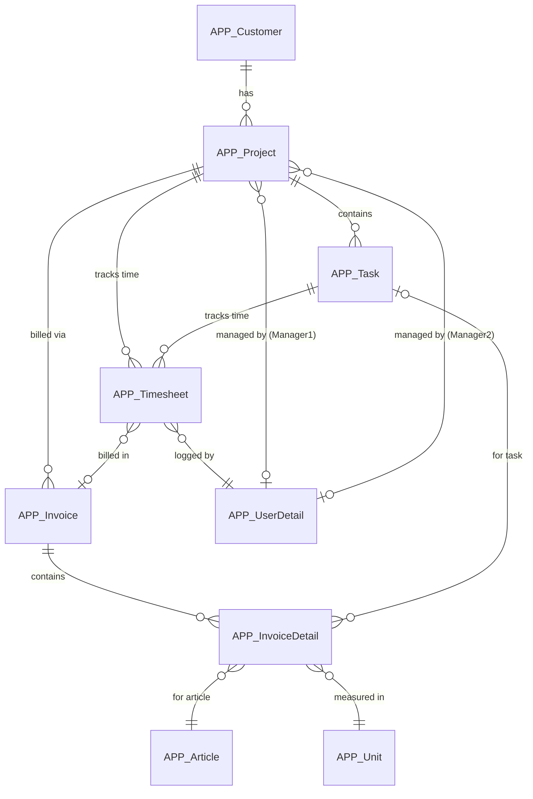
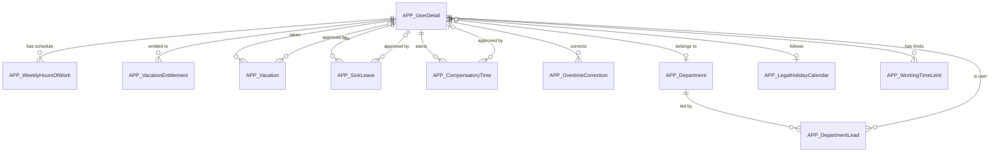
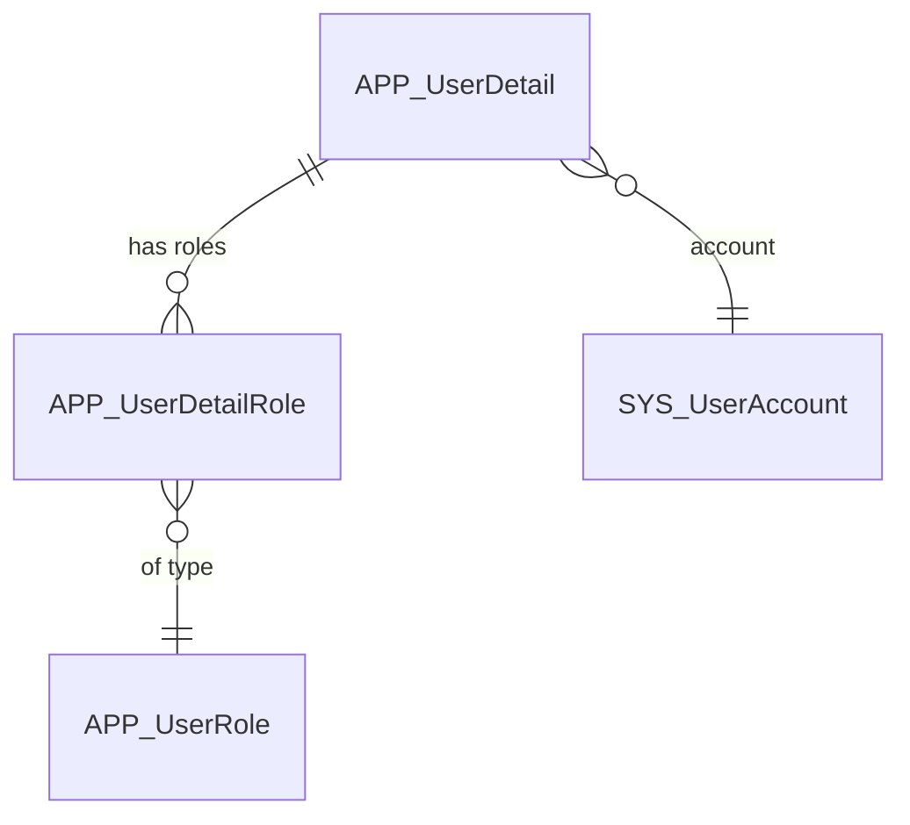

# Enhanced Developer Documentation - Implementation Plan

## 1. Goals & Objectives

**Primary Goal**: Derive actionable, developer-focused documentation from the time cockpit data model that enables:
- Power users to understand and customize the standard data model
- Developers to integrate time cockpit via Web API
- Administrators to implement custom workflows, permissions, and business logic

**Success Metrics**:
- Documented 20+ core APP_ entities with examples
- 3 domain-specific ER diagrams created
- 15+ FAQ items answered with code examples
- Budgetary control lists explained with calculation breakdown
- Security patterns catalog with 5+ permission scenarios

## 2. Data Sources

- **Model File**: `C:\Temp\model-prod.2026-02-09.10-13-35.txt` (complete data model with 90+ entities, permissions, triggers, actions)
- **Current Documentation**: `C:\Repos\time-cockpit-documentation`
- **Web API Docs**: https://docs.timecockpit.com/doc/web-api/overview.html

## 2.1 Documentation Standards & Requirements

### Link Notation Standards
**CRITICAL**: Use `~/doc/` notation for cross-folder documentation links.

**Correct**:
```markdown
[TCQL Overview](~/doc/tcql/overview.md)
[Actions Guide](~/doc/scripting/actions.md)
[Web API OData](~/doc/web-api/odata.md)
```

**Incorrect** (DO NOT USE):
```markdown
[TCQL Overview](../tcql/overview.md)  ❌
[Actions Guide](../../scripting/actions.md)  ❌
```

**Rationale**: The documentation uses DocFX which processes `~/doc/` as root-relative paths. Relative `../` paths may break when files are moved or documentation is built.

### TCQL Function Verification
**CRITICAL**: Only reference TCQL functions that are documented in [doc/tcql/functions-for-working-time-and-holidays.md](~/doc/tcql/functions-for-working-time-and-holidays.md).

**Verified Functions** (as of model-prod.2026-02-09):
- `:RemainingVacationWeeks(userUuid, effectiveDate)`
- `:PlannedHoursOfWork(userUuid, beginTime, endTime, includeLumpSumOvertime)`
- `:ActualHoursOfWork(userUuid, beginTime, endTime, includeWeights)`
- `:Overtime(userUuid, effectiveDate, includeWeights, includeLumpSumOvertime)`
- `:AverageHoursOfWorkPerDay(userUuid, effectiveDate)`

**Do NOT reference** (these do not exist):
- `:GetWorkTime()` ❌
- `:GetBreakTime()` ❌
- `:GetWorkingTimeViolation()` ❌
- `:GetWeeklyHoursOfWork()` ❌

**Validation Process**:
1. Before documenting any TCQL function, verify it exists in the official documentation
2. Check function signature (parameters, return type)
3. Test example queries if possible
4. If unsure, leave it out rather than hallucinate

### Code Example Standards
- **Always include context**: What entity, what scenario
- **Verify against actual model**: Use model-prod.2026-02-09 as source of truth
- **Provide both TCQL and Web API examples** where applicable
- **Include expected output/result** when helpful
- **Add "See Also" links** to related documentation
- **Test code samples** in development environment before documenting

### Entity Documentation Requirements
- **Verify all entity names** exist in the model (APP_* prefix)
- **Verify all property names** match the model exactly
- **Document actual calculated formulas** from the model
- **Include actual permission expressions** from the model
- **Reference only existing relations**

### Quality Checklist
Before committing documentation:
- [ ] All links use `~/doc/` notation for cross-folder references
- [ ] All TCQL functions are verified against official docs
- [ ] All entity/property names match the model file
- [ ] Code examples are tested or copied from working code
- [ ] No hallucinated features or capabilities
- [ ] See Also sections link to existing files
- [ ] Feature page links added where contextually appropriate (user docs)
- [ ] Marketing website URLs verified against actual content

### External Link Standards (Documentation → Marketing Website)

**Purpose**: Create "link juice" and user journey from documentation to marketing content.

**When to Add External Links**:
- User-facing documentation (not developer API docs)
- At document start (TIP boxes) for main feature page
- Inline for relevant blog posts and supplementary content
- FAQ pages for role-specific features and best practices

**URL Patterns**:
- Feature pages: `https://www.timecockpit.com/features/{slug}/`
- Blog posts: `https://www.timecockpit.com/blog/{slug}/`
- Always use absolute URLs, not relative paths

**Verified Feature Page Slugs**:
- `/features/project-time-tracking/`
- `/features/employee-time-tracking/`
- `/features/project-invoicing/`
- `/features/time-tracking-calendar/`
- `/features/activity-tracking/`
- `/features/reporting/`
- `/features/integration/`
- `/features/customization/`
- `/features/enterprise/`
- `/features/security/`
- `/features/saas/`

**Example Blog Post Slugs** (verify before using):
- `/blog/benefits-of-project-time-tracking/`
- `/blog/project-timetracking-kpis/`
- `/blog/project-time-tracking-revenue/`
- `/blog/project-time-tracking-excel-migration-guide/`
- `/blog/time-tracking-mandatory-startups-smb-dach/`

**Placement Examples**:

```markdown
> [!TIP]
> Discover time cockpit's [employee time tracking features](https://www.timecockpit.com/features/employee-time-tracking/) 
> and learn about [legal requirements](https://www.timecockpit.com/blog/time-tracking-mandatory-startups-smb-dach/).

→ [Full Guide](~/doc/timesheet-calendar/working-with-timesheet-entries.md) | 
[Learn about Features](https://www.timecockpit.com/features/time-tracking-calendar/)
```

## 3. Target Audience & Personas

- **Power Users**: Customize entities, create lists, understand standard model
- **Integration Developers**: Use Web API, understand entity relationships, query data
- **Automation Developers**: Write triggers, actions, implement workflows
- **Administrators**: Configure permissions, security, approval processes

## 4. Implementation Phases

### Phase 1: Quick Wins (Week 1-2) - HIGH PRIORITY

#### 1.1 Developer FAQ Page
**File**: `doc/developer-faq.md`

Answer these questions with model-based examples:

**Q: How can I track my budget for a project?**
- Explain `APP_BudgetaryControlOfProjectsList` 
- Show calculated metrics: Budget, Revenue, EffectiveHourlyRate, UnbilledHours
- Link to budgetary control deep-dive

**Q: How can I add default working time for employees?**
- Document `APP_WeeklyHoursOfWork` entity
- Explain EffectiveDate pattern
- Show TCQL query to set 40h/week for all users
- Note: No direct TCQL function to retrieve weekly hours (calculated via entity queries)

**Q: How can I track working time violations?**
- Document `APP_WorkingTimeLimit` entity
- Use `:Overtime()` function for overtime calculation
- Use `:PlannedHoursOfWork()` and `:ActualHoursOfWork()` for comparisons
- Show example: detecting overtime using documented TCQL functions
- Link to "Working Time Violations" list

**Q: How can I integrate with JIRA/external systems?**
- Document `APP_WorkItemChangeSignal` for work item tracking
- Show Web API POST example to create timesheets
- Explain signal tracking concept
- Code sample: Sync JIRA issues to APP_Task

**Q: How can I automate my workflow?**
- Three approaches:
  1. **Triggers**: Vacation approval workflow (dissect actual trigger code)
  2. **Actions**: Invoice creation (show `APP_CreateInvoiceAction` pattern)
  3. **Web API + Scripts**: External automation
- Example: Auto-approve vacation for senior employees

**Additional FAQs**:
- How to calculate overtime/vacation balance?
- How to restrict data access by department?
- How to create custom approval workflows?
- How to build custom aggregation reports?
- How to export data via API?

#### 1.2 Budgetary Control Explained
**File**: `doc/use-cases/budgetary-control.md`

**Content Structure**:
```markdown
## Budgetary Control of Projects

### Overview
The budgetary control lists provide real-time project profitability analysis by combining timesheet and invoice data.

### Key Metrics Calculated

#### From Timesheets
- **Hours**: Total hours logged
- **HoursBillable**: Hours that are billable and have hourly rate > 0
- **Revenue**: Sum of timesheet revenue (hours × rate)
- **RevenueNotBilled**: Revenue from unbilled timesheets
- **Costs**: Sum of (hours × employee internal rate)
- **EffectiveHourlyRate**: Total revenue / total hours

#### From Invoices (Cross-Reference)
- **BilledRevenueFromInvoices**: Actual invoiced amounts
- **BilledHoursFromInvoices**: Hours on invoice details (where unit = "hour")
- **UnbilledHoursFromInvoices**: Budget hours - invoiced hours

### How Values Are Calculated

[Code walkthrough of the Python script in APP_BudgetaryControlOfProjectsList]

### TCQL Queries Used

[Show the actual queries from the list]

### Permissions
Only users with 'BillingAdmin', 'ProjectController', or 'ProjectManager' roles can access.

### Creating Similar Custom Lists

[Tutorial: Building a custom aggregation list]
```

**Similar page for**: Budgetary Control of Tasks

### Phase 2: Core Documentation (Week 3-4)

#### 2.1 Security & Permissions Guide
**File**: `doc/security/permissions-guide.md`

**Content**:
- **Permission Model Overview**: AccessType (Read=1, Write=15, Execute=16, Allowed=32)
- **Named Sets for Security**: `APP_CurrentUserRoles`, `APP_MyDepartmentsAsLead`, `APP_MyProjectsAsManager`
- **Permission Patterns Catalog**:

```markdown
### Pattern 1: Simple Role Check
```tcql
:Iif('BillingAdmin' In Set('CurrentUserRoles'), True, False) = True
```

### Pattern 2: Department-Based Access
```tcql
Current.UserDetail.Department In Set('APP_MyDepartmentsAsLead')
```

### Pattern 3: Project Manager Check
```tcql
('ProjectManager' In Set('CurrentUserRoles') And 
 (Current.APP_Project.APP_Manager1 = Environment.CurrentUser.UserDetailUuid Or 
  Current.APP_Project.APP_Manager2 = Environment.CurrentUser.UserDetailUuid))
```

### Pattern 4: Booking Completion Date (Complex)
```tcql
:Date(Current.BeginTime) > 
  :Iif(Current.UserDetail.DeviatingBookingCompletionDate <> Null And 
       Current.UserDetail.AllowDeviatingBookingCompletionDateUntil >= :Today(), 
       Current.UserDetail.DeviatingBookingCompletionDate, 
       :GetBookingCompletionDate())
```

### Pattern 5: Row-Level Security (Multi-Condition)
[Show APP_Timesheet ReadPermission - allows own data OR dept lead OR project manager]
```

**Sections**:
- Creating Named Sets
- Entity Permissions vs. Property Permissions
- IsDisabledExpression for Feature Flags
- Best Practices
- Testing Permissions

#### 2.2 Standard Data Model Reference
**File**: `doc/data-model/standard-entities.md`

Document **Top 20 Entities** using this template:

```markdown
## APP_Timesheet

### Purpose
Core entity for time tracking - supports both duration entries and from-to bookings.

### Key Properties
| Property | Type | Formula/Default | Description |
|----------|------|-----------------|-------------|
| APP_BeginTime | DateTime | :Today() | Start time of activity |
| APP_EndTime | DateTime | - | End time of activity |
| APP_DurationInHours | Calculated | (Current.EndTime - Current.BeginTime) * 24 | Duration in hours |
| APP_Revenue | Calculated | Current.DurationInHours * Current.APP_HourlyRateActual | Calculated revenue |
| APP_Billable | Boolean | - | Whether entry is billable |
| APP_Billed | Boolean | - | Whether already invoiced |
| APP_Description | Text | - | Activity description |

### Relations
- **APP_Project** (n:1 → APP_Project): Project assignment
- **APP_Task** (n:1 → APP_Task): Optional task within project
- **APP_UserDetail** (n:1 → APP_UserDetail): Employee who logged time
- **APP_Invoice** (n:1 → APP_Invoice): Invoice this is billed to
- **APP_WorkingTimeWeight** (n:1 → APP_WorkingTimeWeight): Weight factor (e.g., overtime multiplier)

### Permissions
**Read**: 
- Own timesheets
- Department leads see their department
- Project managers see their projects
- BillingAdmin / HumanResourcesAdmin / ProjectController see all

**Write**: 
- Own timesheets only
- Only for dates after booking completion date
- HumanResourcesAdmin can edit all

### Validation Rules
- `APP_ValidateBeginEndTime`: End time must be after begin time
- `APP_ValidateTaskProjectCustomerSet`: If task is set, project comes from task

### Common Queries

**Get my timesheets from last month:**
```tcql
From T In APP_Timesheet
Where T.APP_UserDetail.APP_UserDetailUuid = Environment.CurrentUser.UserDetailUuid
  And T.APP_BeginTime >= :AddMonths(:Today(), -1)
  And T.APP_BeginTime < :Today()
Order By T.APP_BeginTime Desc
Select T
```

**Get unbilled hours by project:**
```tcql
From T In APP_Timesheet
Where T.APP_Billed = False And T.APP_Billable = True
Group By T.APP_Project
Select New With {
  .Project = T.APP_Project,
  .UnbilledHours = Sum(T.APP_DurationInHours),
  .UnbilledRevenue = Sum(T.APP_Revenue)
}
```

### Web API Examples

**GET timesheet:**
```http
GET https://api.timecockpit.com/odata/APP_Timesheet(guid'...')
Authorization: Bearer {token}
```

**POST new timesheet:**
```http
POST https://api.timecockpit.com/odata/APP_Timesheet
Content-Type: application/json
Authorization: Bearer {token}

{
  "APP_BeginTime": "2026-02-09T09:00:00Z",
  "APP_EndTime": "2026-02-09T17:00:00Z",
  "APP_Description": "Development work",
  "APP_Project@odata.bind": "APP_Project(guid'...')",
  "APP_UserDetail@odata.bind": "APP_UserDetail(guid'...')"
}
```

### Related Documentation
- [Timesheet Calendar](~/doc/timesheet-calendar/calendar.md)
- [Billing](~/doc/project-time-tracking/billing.md)
- [Web API - OData](~/doc/web-api/odata.md)
```

**Apply to these entities**:
1. APP_Timesheet ✓
2. APP_Project
3. APP_Task
4. APP_Customer
5. APP_Invoice
6. APP_InvoiceDetail
7. APP_UserDetail
8. APP_Department
9. APP_Vacation
10. APP_SickLeave
11. APP_CompensatoryTime
12. APP_WeeklyHoursOfWork
13. APP_VacationEntitlement
14. APP_WorkingTimeLimit
15. APP_Article
16. APP_Company
17. APP_LegalHolidayCalendar
18. APP_UserRole
19. APP_UserDetailRole
20. APP_DepartmentLead

#### 2.3 ER Diagrams (Mermaid)
**File**: `doc/data-model/entity-relationships.md`

**Diagram 1: Project & Billing Domain**


**Diagram 2: Time & Attendance Domain**


**Diagram 3: Security & Roles**


### Phase 3: Advanced Topics (Week 5+)

#### 3.1 Triggers & Automation Guide
**File**: `doc/scripting/triggers-guide.md`

**Content**:
- Trigger Lifecycle (Before/After Save)
- ExecutionMode and ExecutionTime
- Real Example: Vacation Approval Workflow
  - Dissect `APP_Vacation.APP_InsertUpdateAfterSaveTrigger`
  - Show notification creation pattern
  - Explain permission bypass with `SaveSettings.IgnorePermissions`
- Accessing internal APIs via reflection
- Best practices and performance considerations

#### 3.2 Actions Deep Dive
**File**: `doc/scripting/actions-guide.md`

**Content**:
- Action structure and conditions
- Parameter entities (e.g., `APP_AssignTimesheetToInvoiceActionParam`)
- Real Example: Create Invoice Action breakdown
- InputSet and IncludeClause
- Execute permissions
- Creating custom actions

#### 3.3 Calculated Properties Reference
**File**: `doc/data-model/calculated-properties.md`

**Extract all from model**:
- `APP_Article.APP_PriceVat`: Price calculation with VAT
- `APP_Timesheet.APP_DurationInHours`: Time duration
- `APP_Timesheet.APP_Revenue`: Revenue calculation
- `APP_SickLeave.APP_IsApproved`: Approval check
- All formulas with examples and use cases

#### 3.4 Feature Flags System
**File**: `doc/data-model/feature-flags.md`

**Content**:
- How `APP_FeatureFlag` works
- Standard flags (e.g., `APP_DefaultPermissions`)
- Using `:IsFeatureFlagEnabled()` in expressions
- Creating custom feature flags

## 5. Content Standards & Templates

### Entity Documentation Template
See Section 2.2 above

### FAQ Entry Template
```markdown
### Q: [Question]

**Answer**: [Brief explanation]

**Example**:
[Code sample - TCQL, Python, or REST API]

**Related Topics**:
- [Link to entity reference]
- [Link to guide]
```

### Code Example Standards
- Always include context (what entity, what scenario)
- Provide both TCQL and Web API examples where applicable
- Include expected output/result
- Add "See Also" links

## 6. Integration with Existing Documentation

**Update TOC** (`doc/toc.yml`):
```yaml
- name: Data Model Reference (NEW)
  items:
    - name: Overview & ER Diagrams
      href: data-model/entity-relationships.md
    - name: Standard Entities Reference
      href: data-model/standard-entities.md
    - name: Calculated Properties
      href: data-model/calculated-properties.md
    - name: Feature Flags
      href: data-model/feature-flags.md

- name: Security & Permissions (NEW)
  items:
    - name: Permissions Guide
      href: security/permissions-guide.md
    - name: Named Sets
      href: security/named-sets.md
    - name: Row-Level Security
      href: security/row-level-security.md

- name: Developer Resources (NEW)
  items:
    - name: FAQ
      href: developer-faq.md
    - name: Use Cases
      items:
        - name: Budgetary Control
          href: use-cases/budgetary-control.md
        - name: Custom Approval Workflows
          href: use-cases/approval-workflows.md

# Enhance existing sections:
- name: Scripting
  items:
    # ... existing items
    - name: Advanced Topics (NEW)
      items:
        - name: Triggers Deep Dive
          href: scripting/triggers-guide.md
        - name: Actions Deep Dive
          href: scripting/actions-guide.md
```

## 7. Automated Content Generation

**Scripts to create** (in `tools/doc-generator/`):
1. `extract-entities.py`: Generate entity tables from model JSON
2. `extract-permissions.py`: List all permission patterns
3. `extract-calculated-properties.py`: Extract all formulas
4. `generate-entity-stub.py`: Create entity doc template

## 8. Open Questions & Decisions

- [ ] Include SYS_* entities in reference? (Decision: Only overview, link to API docs)
- [ ] Document signal tracking deeply? (Decision: Overview + 2-3 examples, not exhaustive)
- [ ] Separate page per entity or group by domain? (Decision: Start with single page, split if > 50KB)
- [ ] Include deprecated features? (Decision: Mark as deprecated but document briefly)

## 8.1 Resolved Issues

**Issue: Link Notation Inconsistency**
- **Problem**: Mixed use of `~/doc/` and `../` relative paths across documentation
- **Resolution**: Standardize on `~/doc/` notation for all cross-folder links
- **Date**: 2026-02-09
- **Files Updated**: `doc/web-api/overview.md`, `specs/ai-generated-content.md`

**Issue: Hallucinated TCQL Functions**
- **Problem**: developer-faq.md referenced non-existent functions (`:GetWorkTime()`, `:GetBreakTime()`, `:GetWorkingTimeViolation()`, `:GetWeeklyHoursOfWork()`)
- **Resolution**: Replaced with documented functions from `doc/tcql/functions-for-working-time-and-holidays.md`
- **Verified Functions**: `:Overtime()`, `:PlannedHoursOfWork()`, `:ActualHoursOfWork()`, `:RemainingVacationWeeks()`, `:AverageHoursOfWorkPerDay()`
- **Date**: 2026-02-09
- **Files Updated**: `doc/developer-faq.md`

**Lesson Learned**: Always verify TCQL functions against official documentation before documenting examples. Do not hallucinate or assume functions exist based on naming patterns.

**Issue: Link Building to Marketing Website**
- **Problem**: Documentation was isolated from main marketing website (www.timecockpit.com), missing opportunities for cross-linking
- **Resolution**: Added strategic internal links from documentation to feature pages and blog posts
- **Date**: 2026-02-09
- **Strategy**: 
  - Focus on business/user documentation (not developer docs)
  - Link to feature pages: `/features/project-time-tracking/`, `/features/employee-time-tracking/`, etc.
  - Link to relevant blog posts: `/blog/benefits-of-project-time-tracking/`, `/blog/project-timetracking-kpis/`, etc.
  - Use contextual linking (natural flow) rather than forced links
  - Verify all URLs exist and use correct slugs
- **Files Updated**: 
  - `doc/for-users.md` - Added feature overview section + contextual links
  - `doc/project-time-tracking/billing.md` - Invoicing features + blog
  - `doc/project-time-tracking/customer-project-task.md` - Project features + blog
  - `doc/employee-time-tracking/working-time.md` - Employee tracking + compliance blog
  - `doc/employee-time-tracking/absence-time-management.md` - Employee features
  - `doc/timesheet-calendar/calendar.md` - Calendar features
  - `doc/signal-tracker/overview.md` - Activity tracking features
  - `doc/reporting/overview.md` - Reporting features + KPIs blog
  - `doc/data-exchange/import.md` - Integration + Excel migration blog
  - `doc/project-manager-faq.md` - Project features + blogs
  - `doc/billing-admin-faq.md` - Invoicing + revenue blog
  - `doc/hr-administrator-faq.md` - Employee tracking + compliance blog

**Link Building Guidelines**:
1. **Use absolute URLs** for cross-domain links: `https://www.timecockpit.com/features/...`
2. **Verify slugs** from actual content files in `TimeCockpit.WebsiteV2/src/content/`
3. **Contextual placement**: Add links where they naturally enhance user understanding
4. **TIP boxes**: Use for prominent feature page links at document start
5. **Inline links**: Use for blog posts and supplementary content
6. **Arrow notation**: Use `→` for "Learn more" style links
7. **Target user journey**: Link users from "how-to" docs to "why" and "what" content on website

**Lesson Learned**: Documentation should serve as a bridge between product usage and product marketing, helping users discover features and understand business value.

**Issue: Incorrect Action Parameter Descriptions**
- **Problem**: Documentation described actions with parameters incorrectly, suggesting UI dialogs that show summary data (customer info, line items, totals) when actually parameter forms only show the fields defined in the parameter entity
- **Resolution**: Documented the actual action parameter pattern based on model structure
- **Date**: 2026-02-09
- **Key Understanding**:
  - **Action Parameter Structure**: Actions with parameters reference a parameter entity via `"Parameter": { "ModelEntityName": "APP_EntityName" }`
  - **Parameter Entity** defines the fields shown in the parameter form (properties and relations only)
  - **ExecuteWithoutPrompt**: When `false`, shows parameter form; when `true`, executes immediately without user input
  - **Example APP_CreateInvoiceAction**: Shows parameter form with APP_CreateInvoiceParameter fields (InvoiceDate, InvoiceNumber, InvoiceDescription, ServiceStartDate, ServiceEndDate). The action code then creates the invoice and invoice details programmatically based on selected timesheet entries
  - **Not shown in parameter form**: Customer info, line items, totals - these are computed by the action code itself
- **Files Updated**: `specs/ai-generated-content.md`, `doc/billing-admin-faq.md`, and any other FAQ files with action descriptions

**Documenting Action Parameters - Pattern**:

When documenting an action that has parameters:

1. **Check if action has a parameter**:
   ```json
   "Parameter": {
       "$type": "TimeCockpit.Data.DataModel.Actions.TypedParameter, TimeCockpit.Data",
       "ModelEntityName": "APP_CreateInvoiceParameter"
   }
   ```

2. **Look up the parameter entity** in the model (e.g., `APP_CreateInvoiceParameter`)

3. **Document the actual parameter fields**:
   - List each **Property** with its type, nullability, and default value
   - List each **Relation** with its target entity and nullability
   - Note any default value expressions

4. **Do NOT describe**:
   - Computed data that appears after action execution
   - Summary information the action calculates
   - Data from selected InputSet entities (those are inputs, not parameters)

5. **Example - APP_CreateInvoiceAction Parameter Form**:

   **Parameter Form Shows**:
   - **Invoice Date** (DateTime, required, default: today)
   - **Invoice Number** (Text, required, default: auto-generated)
   - **Description** (Text, optional, max 200 chars)
   - **Service Period Start** (Date, optional)
   - **Service Period End** (Date, optional)
   - **Deviating Revenue** (Numeric, optional)

   **Parameter Form Does NOT Show**:
   - Customer information (determined from selected timesheets' project)
   - Line items (created by action from grouped timesheet entries)
   - Total amounts (calculated by action)
   - Selected timesheet entries (those are the InputSet)

**Lesson Learned**: Always verify action behavior against the model definition. Parameter forms only show fields defined in the parameter entity, not computed or summary data.

**Issue: Business User Documentation Needs Workflow-Based Approach**
- **Problem**: Technical documentation doesn't provide clear step-by-step workflows for business users to accomplish common tasks
- **Resolution**: Document features as workflows referencing specific lists, with dedicated pages for each important list
- **Date**: 2026-02-09
- **Approach**: Top-down workflow documentation

### Workflow-Based Documentation Pattern for Business Users

**Philosophy**: Business users think in terms of "What do I want to accomplish?" not "What entity/list should I use?"

**Structure**:
1. **Feature Workflow Page** (e.g., "Creating Invoices", "Reviewing Project Budgets")
   - Goal/outcome stated clearly
   - Step-by-step process
   - References to specific lists used
   - Links to list detail pages
   
2. **List Detail Pages** (e.g., "Unbilled Timesheets List", "Budgetary Control of Projects")
   - Purpose of the list
   - How to access it
   - Available filters and their purpose
   - Column descriptions
   - For script lists: Logic explanation (especially budget calculations)
   - Common use cases

**Example Workflows to Document**:
- How to create an invoice
- How to view actual vs. target hours
- How to view working time saldo (balance)
- How to display vacation saldo
- How to view working time violations
- How to review budgets of projects and tasks
- How to approve absence requests
- How to track unbilled hours

### Extracting Information from NamedListConfiguration

**NamedListConfiguration** appears in navigation, hyperlinks, and actions. It specifies which list to open.

**Pattern 1: ModelEntityName specified**
```xml
<NamedListConfiguration ModelEntityName="APP_Timesheet">
```
**Process**:
1. Look up entity in model: `APP_Timesheet`
2. Find `DefaultListName` property: e.g., `"APP_DefaultTimesheetList"`
3. Go to that list definition in EntityViews
4. Document the list

**Pattern 2: List/ListName property specified**
```xml
<NamedListConfiguration List="APP_BudgetaryControlOfProjectsList">
```
**Process**:
1. Go directly to EntityViews
2. Find `APP_BudgetaryControlOfProjectsList`
3. Document the list

### Documenting Lists - Template

```markdown
## [List Name] (e.g., "Unbilled Timesheets List")

### Purpose
[What business problem does this solve? What information does it show?]

### Access Path
**Navigation**: [Path in UI, e.g., "Timesheet → Unbilled Time Sheets"]
**Direct**: [List name for technical reference]

### Filters

| Filter | Type | Default | Purpose |
|--------|------|---------|---------|
| Project | Relation | None | Filter to specific project |
| Customer | Relation | None | Filter to specific customer |
| Begin Time | Date | Last month | Start of date range |
| Billed | Boolean | False | Show only unbilled entries |

### Columns

| Column | Description | Calculation/Source |
|--------|-------------|-------------------|
| User | Employee who logged time | APP_UserDetail relation |
| Date | Date of work | APP_BeginTime |
| Duration | Hours worked | Calculated from BeginTime - EndTime |
| Revenue | Billable amount | Hours × Hourly Rate |

### For Script Lists: Logic Explanation

[For lists with ScriptSource, explain the calculation logic]

**Example: Budgetary Control of Projects**

**Key Metrics Calculated**:
- **Hours**: Sum of all timesheet durations for project
- **HoursBillable**: Sum of hours where Billable=True AND HourlyRate > 0
- **Revenue**: Sum of (Duration × HourlyRate) from timesheets
- **RevenueNotBilled**: Revenue where Billed=False
- **Budget**: Project.Budget or (BudgetInHours × HourlyRate)
- **EffectiveHourlyRate**: Total Revenue ÷ Total Hours
- **BilledRevenueFromInvoices**: Sum of invoice.Revenue for project
- **UnbilledHoursFromInvoices**: BudgetInHours - Invoiced Hours

**Data Sources**:
1. Timesheet query grouped by project
2. Invoice query for billed amounts
3. InvoiceDetail query for invoiced hours (where unit="hour")

**Permission Logic**:
Only accessible to users with roles: BillingAdmin, ProjectController, or ProjectManager

### Common Use Cases

**Use Case 1**: [Common scenario]
1. [Step]
2. [Step]
3. [Result]

**Use Case 2**: [Another scenario]
1. [Step]
2. [Step]
3. [Result]

### Related Lists
- [Link to related list 1]
- [Link to related list 2]

### See Also
- [Link to workflow documentation]
- [Link to entity reference]
```

### Workflow Documentation - Template

```markdown
## [Workflow Name] (e.g., "Creating an Invoice")

### Goal
[What does the user want to accomplish?]

### Prerequisites
- [What data/setup must exist first?]
- [What permissions are required?]

### Step-by-Step Process

**Step 1: Identify Unbilled Work**
1. Navigate to: **[List Name]**
   - *See: [Link to list detail page]*
2. Apply filters:
   - [Filter 1]
   - [Filter 2]
3. Review the results

**Step 2: Select Entries**
1. [Selection method]
2. [Validation to perform]

**Step 3: Execute Action**
1. Click **[Action Name]**
2. **Parameter form appears**:
   - [Parameter 1]: [Description]
   - [Parameter 2]: [Description]
3. Click **OK**

**Step 4: Verify Result**
1. Navigate to: **[Result List]**
   - *See: [Link to list detail page]*
2. Verify [expected outcome]

### What Happens Behind the Scenes
[Brief non-technical explanation of what the system does]

### Common Issues & Solutions

**Issue**: [Common problem]
**Cause**: [Why it happens]
**Solution**: [How to fix]

### Related Workflows
- [Link to related workflow 1]
- [Link to related workflow 2]

### See Also
- [Link to list detail pages used]
- [Link to action documentation]
```

### Lists to Document (High Priority)

**Invoicing & Billing**:
- APP_DefaultTimesheetList (with Billed=False filter) → "Unbilled Timesheets List"
- APP_DefaultInvoiceList → "Outgoing Invoices List"
- APP_BudgetaryControlOfProjectsList → "Project Budget Control List"
- APP_BudgetaryControlOfTasksList → "Task Budget Control List"

**Time & Attendance**:
- APP_DefaultAbsenceTimeCalendarList → "Absence Calendar List"
- APP_DefaultAbsenceTimeCalendarWeeklyHoursOfWorkList → "Weekly Hours of Work List"
- APP_DefaultVacationList → "Vacation Requests List"
- APP_DefaultSickLeaveList → "Sick Leave List"

**Project Management**:
- APP_DefaultProjectList → "Projects List"
- APP_DefaultTaskList → "Tasks List"
- APP_DefaultCustomerList → "Customers List"

**Working Time**:
- Lists that show working time saldo
- Lists that show actual vs. target hours
- Lists that show working time violations
- Lists that show vacation balance

### Extracting List Information from Model

**Step 1: Find list in EntityViews**
```json
"APP_BudgetaryControlOfProjectsList": {
  "ConfigurationMarkup": "<List ...>",
  "InvariantFriendlyName": "BudgetaryControlOfProjectsList",
  "TargetEntity": { "$ref": "Model.Entities.APP_Project" },
  "TypeName": "TimeCockpit.Data.DataModel.View.List"
}
```

**Step 2: Extract from ConfigurationMarkup**:
- **Filter section**: `<List.Filter>` → Shows available filters
- **Columns**: `<BoundCell>`, `<NumericCell>`, etc. → Shows columns and calculations
- **ScriptSource**: `<List.ScriptSource>` → Python logic for calculated lists
- **Permissions**: Check Permissions property for access control

**Step 3: For Script Lists, analyze ScriptSource**:
- Look for `getResultModelEntity()` → Shows result structure (columns)
- Look for `getItems()` → Shows calculation logic
- Look for queries → Shows data sources
- Document the calculation formulas in plain language

**Lesson Learned**: Business users need workflow-oriented documentation that answers "How do I..." questions, not entity-oriented documentation. Always link workflows to the specific lists and reference detailed list documentation for filters and logic.

## 9. Success Criteria Checklist

- [ ] FAQ page with 15+ answered questions
- [ ] Budgetary control list fully explained with code walkthrough
- [ ] 3 ER diagrams (Billing, Attendance, Security)
- [ ] 20+ entities documented with template
- [ ] Security patterns catalog with 5+ examples
- [ ] Triggers guide with vacation approval walkthrough
- [ ] Actions guide with invoice creation example
- [ ] Calculated properties reference
- [ ] Feature flags documented
- [ ] TOC updated and integrated

## 10. Timeline Summary

| Week | Focus | Deliverable |
|------|-------|-------------|
| 1 | FAQ + Quick Wins | FAQ page, Budgetary Control guide |
| 2 | Core Entities | 10 entity docs, ER diagrams |
| 3 | Security | Permissions guide, Named Sets |
| 4 | More Entities | Complete 20 entity docs |
| 5 | Advanced Topics | Triggers, Actions, Calculated Props |
| 6 | Polish & Review | Integration testing, final review |