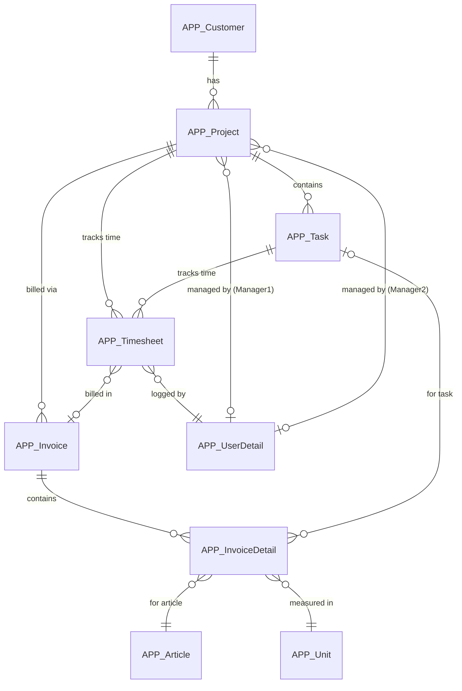
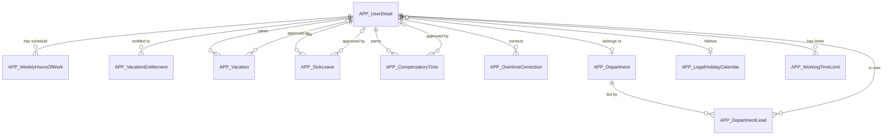
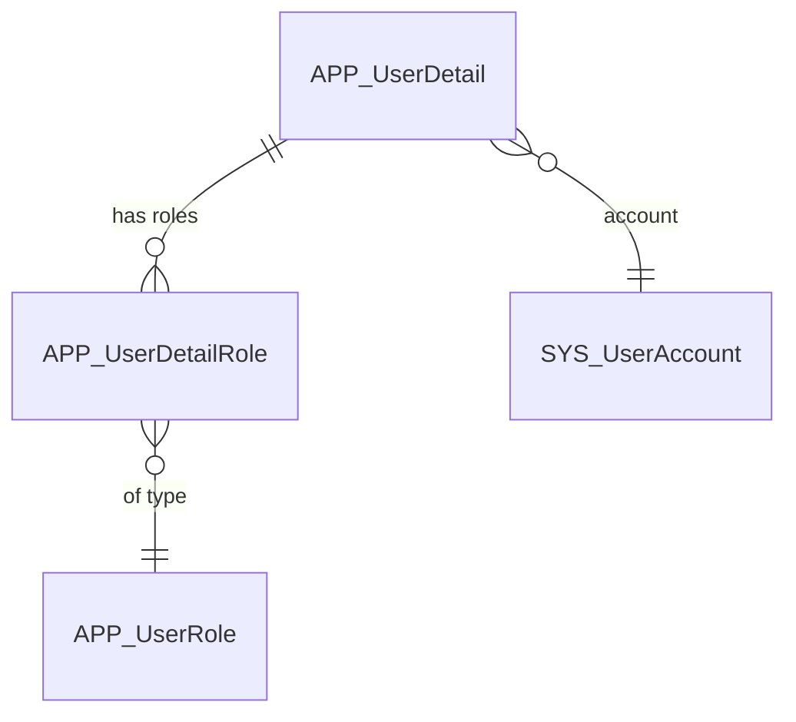

# Enhanced Developer Documentation - Implementation Plan

## 1. Goals & Objectives

**Primary Goal**: Derive actionable, developer-focused documentation from the time cockpit data model that enables:
- Power users to understand and customize the standard data model
- Developers to integrate time cockpit via Web API
- Administrators to implement custom workflows, permissions, and business logic

**Success Metrics**:
- Documented 20+ core APP_ entities with examples
- 3 domain-specific ER diagrams created
- 15+ FAQ items answered with code examples
- Budgetary control lists explained with calculation breakdown
- Security patterns catalog with 5+ permission scenarios

## 2. Data Sources

- **Model File**: `C:\Temp\model-prod.2026-02-09.10-13-35.txt` (complete data model with 90+ entities, permissions, triggers, actions)
- **Current Documentation**: `C:\Repos\time-cockpit-documentation`
- **Web API Docs**: https://docs.timecockpit.com/doc/web-api/overview.html

## 2.1 Documentation Standards & Requirements

### Link Notation Standards
**CRITICAL**: Use `~/doc/` notation for cross-folder documentation links.

**Correct**:
```markdown
[TCQL Overview](~/doc/tcql/overview.md)
[Actions Guide](~/doc/scripting/actions.md)
[Web API OData](~/doc/web-api/odata.md)
```

**Incorrect** (DO NOT USE):
```markdown
[TCQL Overview](../tcql/overview.md)  ❌
[Actions Guide](../../scripting/actions.md)  ❌
```

**Rationale**: The documentation uses DocFX which processes `~/doc/` as root-relative paths. Relative `../` paths may break when files are moved or documentation is built.

### TCQL Function Verification
**CRITICAL**: Only reference TCQL functions that are documented in [doc/tcql/functions-for-working-time-and-holidays.md](~/doc/tcql/functions-for-working-time-and-holidays.md).

**Verified Functions** (as of model-prod.2026-02-09):
- `:RemainingVacationWeeks(userUuid, effectiveDate)`
- `:PlannedHoursOfWork(userUuid, beginTime, endTime, includeLumpSumOvertime)`
- `:ActualHoursOfWork(userUuid, beginTime, endTime, includeWeights)`
- `:Overtime(userUuid, effectiveDate, includeWeights, includeLumpSumOvertime)`
- `:AverageHoursOfWorkPerDay(userUuid, effectiveDate)`

**Do NOT reference** (these do not exist):
- `:GetWorkTime()` ❌
- `:GetBreakTime()` ❌
- `:GetWorkingTimeViolation()` ❌
- `:GetWeeklyHoursOfWork()` ❌

**Validation Process**:
1. Before documenting any TCQL function, verify it exists in the official documentation
2. Check function signature (parameters, return type)
3. Test example queries if possible
4. If unsure, leave it out rather than hallucinate

### Code Example Standards
- **Always include context**: What entity, what scenario
- **Verify against actual model**: Use model-prod.2026-02-09 as source of truth
- **Provide both TCQL and Web API examples** where applicable
- **Include expected output/result** when helpful
- **Add "See Also" links** to related documentation
- **Test code samples** in development environment before documenting

### Entity Documentation Requirements
- **Verify all entity names** exist in the model (APP_* prefix)
- **Verify all property names** match the model exactly
- **Document actual calculated formulas** from the model
- **Include actual permission expressions** from the model
- **Reference only existing relations**

### Quality Checklist
Before committing documentation:
- [ ] All links use `~/doc/` notation for cross-folder references
- [ ] All TCQL functions are verified against official docs
- [ ] All entity/property names match the model file
- [ ] Code examples are tested or copied from working code
- [ ] No hallucinated features or capabilities
- [ ] See Also sections link to existing files

## 3. Target Audience & Personas

- **Power Users**: Customize entities, create lists, understand standard model
- **Integration Developers**: Use Web API, understand entity relationships, query data
- **Automation Developers**: Write triggers, actions, implement workflows
- **Administrators**: Configure permissions, security, approval processes

## 4. Implementation Phases

### Phase 1: Quick Wins (Week 1-2) - HIGH PRIORITY

#### 1.1 Developer FAQ Page
**File**: `doc/developer-faq.md`

Answer these questions with model-based examples:

**Q: How can I track my budget for a project?**
- Explain `APP_BudgetaryControlOfProjectsList` 
- Show calculated metrics: Budget, Revenue, EffectiveHourlyRate, UnbilledHours
- Link to budgetary control deep-dive

**Q: How can I add default working time for employees?**
- Document `APP_WeeklyHoursOfWork` entity
- Explain EffectiveDate pattern
- Show TCQL query to set 40h/week for all users
- Note: No direct TCQL function to retrieve weekly hours (calculated via entity queries)

**Q: How can I track working time violations?**
- Document `APP_WorkingTimeLimit` entity
- Use `:Overtime()` function for overtime calculation
- Use `:PlannedHoursOfWork()` and `:ActualHoursOfWork()` for comparisons
- Show example: detecting overtime using documented TCQL functions
- Link to "Working Time Violations" list

**Q: How can I integrate with JIRA/external systems?**
- Document `APP_WorkItemChangeSignal` for work item tracking
- Show Web API POST example to create timesheets
- Explain signal tracking concept
- Code sample: Sync JIRA issues to APP_Task

**Q: How can I automate my workflow?**
- Three approaches:
  1. **Triggers**: Vacation approval workflow (dissect actual trigger code)
  2. **Actions**: Invoice creation (show `APP_CreateInvoiceAction` pattern)
  3. **Web API + Scripts**: External automation
- Example: Auto-approve vacation for senior employees

**Additional FAQs**:
- How to calculate overtime/vacation balance?
- How to restrict data access by department?
- How to create custom approval workflows?
- How to build custom aggregation reports?
- How to export data via API?

#### 1.2 Budgetary Control Explained
**File**: `doc/use-cases/budgetary-control.md`

**Content Structure**:
```markdown
## Budgetary Control of Projects

### Overview
The budgetary control lists provide real-time project profitability analysis by combining timesheet and invoice data.

### Key Metrics Calculated

#### From Timesheets
- **Hours**: Total hours logged
- **HoursBillable**: Hours that are billable and have hourly rate > 0
- **Revenue**: Sum of timesheet revenue (hours × rate)
- **RevenueNotBilled**: Revenue from unbilled timesheets
- **Costs**: Sum of (hours × employee internal rate)
- **EffectiveHourlyRate**: Total revenue / total hours

#### From Invoices (Cross-Reference)
- **BilledRevenueFromInvoices**: Actual invoiced amounts
- **BilledHoursFromInvoices**: Hours on invoice details (where unit = "hour")
- **UnbilledHoursFromInvoices**: Budget hours - invoiced hours

### How Values Are Calculated

[Code walkthrough of the Python script in APP_BudgetaryControlOfProjectsList]

### TCQL Queries Used

[Show the actual queries from the list]

### Permissions
Only users with 'BillingAdmin', 'ProjectController', or 'ProjectManager' roles can access.

### Creating Similar Custom Lists

[Tutorial: Building a custom aggregation list]
```

**Similar page for**: Budgetary Control of Tasks

### Phase 2: Core Documentation (Week 3-4)

#### 2.1 Security & Permissions Guide
**File**: `doc/security/permissions-guide.md`

**Content**:
- **Permission Model Overview**: AccessType (Read=1, Write=15, Execute=16, Allowed=32)
- **Named Sets for Security**: `APP_CurrentUserRoles`, `APP_MyDepartmentsAsLead`, `APP_MyProjectsAsManager`
- **Permission Patterns Catalog**:

```markdown
### Pattern 1: Simple Role Check
```tcql
:Iif('BillingAdmin' In Set('CurrentUserRoles'), True, False) = True
```

### Pattern 2: Department-Based Access
```tcql
Current.UserDetail.Department In Set('APP_MyDepartmentsAsLead')
```

### Pattern 3: Project Manager Check
```tcql
('ProjectManager' In Set('CurrentUserRoles') And 
 (Current.APP_Project.APP_Manager1 = Environment.CurrentUser.UserDetailUuid Or 
  Current.APP_Project.APP_Manager2 = Environment.CurrentUser.UserDetailUuid))
```

### Pattern 4: Booking Completion Date (Complex)
```tcql
:Date(Current.BeginTime) > 
  :Iif(Current.UserDetail.DeviatingBookingCompletionDate <> Null And 
       Current.UserDetail.AllowDeviatingBookingCompletionDateUntil >= :Today(), 
       Current.UserDetail.DeviatingBookingCompletionDate, 
       :GetBookingCompletionDate())
```

### Pattern 5: Row-Level Security (Multi-Condition)
[Show APP_Timesheet ReadPermission - allows own data OR dept lead OR project manager]
```

**Sections**:
- Creating Named Sets
- Entity Permissions vs. Property Permissions
- IsDisabledExpression for Feature Flags
- Best Practices
- Testing Permissions

#### 2.2 Standard Data Model Reference
**File**: `doc/data-model/standard-entities.md`

Document **Top 20 Entities** using this template:

```markdown
## APP_Timesheet

### Purpose
Core entity for time tracking - supports both duration entries and from-to bookings.

### Key Properties
| Property | Type | Formula/Default | Description |
|----------|------|-----------------|-------------|
| APP_BeginTime | DateTime | :Today() | Start time of activity |
| APP_EndTime | DateTime | - | End time of activity |
| APP_DurationInHours | Calculated | (Current.EndTime - Current.BeginTime) * 24 | Duration in hours |
| APP_Revenue | Calculated | Current.DurationInHours * Current.APP_HourlyRateActual | Calculated revenue |
| APP_Billable | Boolean | - | Whether entry is billable |
| APP_Billed | Boolean | - | Whether already invoiced |
| APP_Description | Text | - | Activity description |

### Relations
- **APP_Project** (n:1 → APP_Project): Project assignment
- **APP_Task** (n:1 → APP_Task): Optional task within project
- **APP_UserDetail** (n:1 → APP_UserDetail): Employee who logged time
- **APP_Invoice** (n:1 → APP_Invoice): Invoice this is billed to
- **APP_WorkingTimeWeight** (n:1 → APP_WorkingTimeWeight): Weight factor (e.g., overtime multiplier)

### Permissions
**Read**: 
- Own timesheets
- Department leads see their department
- Project managers see their projects
- BillingAdmin / HumanResourcesAdmin / ProjectController see all

**Write**: 
- Own timesheets only
- Only for dates after booking completion date
- HumanResourcesAdmin can edit all

### Validation Rules
- `APP_ValidateBeginEndTime`: End time must be after begin time
- `APP_ValidateTaskProjectCustomerSet`: If task is set, project comes from task

### Common Queries

**Get my timesheets from last month:**
```tcql
From T In APP_Timesheet
Where T.APP_UserDetail.APP_UserDetailUuid = Environment.CurrentUser.UserDetailUuid
  And T.APP_BeginTime >= :AddMonths(:Today(), -1)
  And T.APP_BeginTime < :Today()
Order By T.APP_BeginTime Desc
Select T
```

**Get unbilled hours by project:**
```tcql
From T In APP_Timesheet
Where T.APP_Billed = False And T.APP_Billable = True
Group By T.APP_Project
Select New With {
  .Project = T.APP_Project,
  .UnbilledHours = Sum(T.APP_DurationInHours),
  .UnbilledRevenue = Sum(T.APP_Revenue)
}
```

### Web API Examples

**GET timesheet:**
```http
GET https://api.timecockpit.com/odata/APP_Timesheet(guid'...')
Authorization: Bearer {token}
```

**POST new timesheet:**
```http
POST https://api.timecockpit.com/odata/APP_Timesheet
Content-Type: application/json
Authorization: Bearer {token}

{
  "APP_BeginTime": "2026-02-09T09:00:00Z",
  "APP_EndTime": "2026-02-09T17:00:00Z",
  "APP_Description": "Development work",
  "APP_Project@odata.bind": "APP_Project(guid'...')",
  "APP_UserDetail@odata.bind": "APP_UserDetail(guid'...')"
}
```

### Related Documentation
- [Timesheet Calendar](~/doc/timesheet-calendar/calendar.md)
- [Billing](~/doc/project-time-tracking/billing.md)
- [Web API - OData](~/doc/web-api/odata.md)
```

**Apply to these entities**:
1. APP_Timesheet ✓
2. APP_Project
3. APP_Task
4. APP_Customer
5. APP_Invoice
6. APP_InvoiceDetail
7. APP_UserDetail
8. APP_Department
9. APP_Vacation
10. APP_SickLeave
11. APP_CompensatoryTime
12. APP_WeeklyHoursOfWork
13. APP_VacationEntitlement
14. APP_WorkingTimeLimit
15. APP_Article
16. APP_Company
17. APP_LegalHolidayCalendar
18. APP_UserRole
19. APP_UserDetailRole
20. APP_DepartmentLead

#### 2.3 ER Diagrams (Mermaid)
**File**: `doc/data-model/entity-relationships.md`

**Diagram 1: Project & Billing Domain**


**Diagram 2: Time & Attendance Domain**


**Diagram 3: Security & Roles**


### Phase 3: Advanced Topics (Week 5+)

#### 3.1 Triggers & Automation Guide
**File**: `doc/scripting/triggers-guide.md`

**Content**:
- Trigger Lifecycle (Before/After Save)
- ExecutionMode and ExecutionTime
- Real Example: Vacation Approval Workflow
  - Dissect `APP_Vacation.APP_InsertUpdateAfterSaveTrigger`
  - Show notification creation pattern
  - Explain permission bypass with `SaveSettings.IgnorePermissions`
- Accessing internal APIs via reflection
- Best practices and performance considerations

#### 3.2 Actions Deep Dive
**File**: `doc/scripting/actions-guide.md`

**Content**:
- Action structure and conditions
- Parameter entities (e.g., `APP_AssignTimesheetToInvoiceActionParam`)
- Real Example: Create Invoice Action breakdown
- InputSet and IncludeClause
- Execute permissions
- Creating custom actions

#### 3.3 Calculated Properties Reference
**File**: `doc/data-model/calculated-properties.md`

**Extract all from model**:
- `APP_Article.APP_PriceVat`: Price calculation with VAT
- `APP_Timesheet.APP_DurationInHours`: Time duration
- `APP_Timesheet.APP_Revenue`: Revenue calculation
- `APP_SickLeave.APP_IsApproved`: Approval check
- All formulas with examples and use cases

#### 3.4 Feature Flags System
**File**: `doc/data-model/feature-flags.md`

**Content**:
- How `APP_FeatureFlag` works
- Standard flags (e.g., `APP_DefaultPermissions`)
- Using `:IsFeatureFlagEnabled()` in expressions
- Creating custom feature flags

## 5. Content Standards & Templates

### Entity Documentation Template
See Section 2.2 above

### FAQ Entry Template
```markdown
### Q: [Question]

**Answer**: [Brief explanation]

**Example**:
[Code sample - TCQL, Python, or REST API]

**Related Topics**:
- [Link to entity reference]
- [Link to guide]
```

### Code Example Standards
- Always include context (what entity, what scenario)
- Provide both TCQL and Web API examples where applicable
- Include expected output/result
- Add "See Also" links

## 6. Integration with Existing Documentation

**Update TOC** (`doc/toc.yml`):
```yaml
- name: Data Model Reference (NEW)
  items:
    - name: Overview & ER Diagrams
      href: data-model/entity-relationships.md
    - name: Standard Entities Reference
      href: data-model/standard-entities.md
    - name: Calculated Properties
      href: data-model/calculated-properties.md
    - name: Feature Flags
      href: data-model/feature-flags.md

- name: Security & Permissions (NEW)
  items:
    - name: Permissions Guide
      href: security/permissions-guide.md
    - name: Named Sets
      href: security/named-sets.md
    - name: Row-Level Security
      href: security/row-level-security.md

- name: Developer Resources (NEW)
  items:
    - name: FAQ
      href: developer-faq.md
    - name: Use Cases
      items:
        - name: Budgetary Control
          href: use-cases/budgetary-control.md
        - name: Custom Approval Workflows
          href: use-cases/approval-workflows.md

# Enhance existing sections:
- name: Scripting
  items:
    # ... existing items
    - name: Advanced Topics (NEW)
      items:
        - name: Triggers Deep Dive
          href: scripting/triggers-guide.md
        - name: Actions Deep Dive
          href: scripting/actions-guide.md
```

## 7. Automated Content Generation

**Scripts to create** (in `tools/doc-generator/`):
1. `extract-entities.py`: Generate entity tables from model JSON
2. `extract-permissions.py`: List all permission patterns
3. `extract-calculated-properties.py`: Extract all formulas
4. `generate-entity-stub.py`: Create entity doc template

## 8. Open Questions & Decisions

- [ ] Include SYS_* entities in reference? (Decision: Only overview, link to API docs)
- [ ] Document signal tracking deeply? (Decision: Overview + 2-3 examples, not exhaustive)
- [ ] Separate page per entity or group by domain? (Decision: Start with single page, split if > 50KB)
- [ ] Include deprecated features? (Decision: Mark as deprecated but document briefly)

## 8.1 Resolved Issues

**Issue: Link Notation Inconsistency**
- **Problem**: Mixed use of `~/doc/` and `../` relative paths across documentation
- **Resolution**: Standardize on `~/doc/` notation for all cross-folder links
- **Date**: 2026-02-09
- **Files Updated**: `doc/web-api/overview.md`, `specs/ai-generated-content.md`

**Issue: Hallucinated TCQL Functions**
- **Problem**: developer-faq.md referenced non-existent functions (`:GetWorkTime()`, `:GetBreakTime()`, `:GetWorkingTimeViolation()`, `:GetWeeklyHoursOfWork()`)
- **Resolution**: Replaced with documented functions from `doc/tcql/functions-for-working-time-and-holidays.md`
- **Verified Functions**: `:Overtime()`, `:PlannedHoursOfWork()`, `:ActualHoursOfWork()`, `:RemainingVacationWeeks()`, `:AverageHoursOfWorkPerDay()`
- **Date**: 2026-02-09
- **Files Updated**: `doc/developer-faq.md`

**Lesson Learned**: Always verify TCQL functions against official documentation before documenting examples. Do not hallucinate or assume functions exist based on naming patterns.

## 9. Success Criteria Checklist

- [ ] FAQ page with 15+ answered questions
- [ ] Budgetary control list fully explained with code walkthrough
- [ ] 3 ER diagrams (Billing, Attendance, Security)
- [ ] 20+ entities documented with template
- [ ] Security patterns catalog with 5+ examples
- [ ] Triggers guide with vacation approval walkthrough
- [ ] Actions guide with invoice creation example
- [ ] Calculated properties reference
- [ ] Feature flags documented
- [ ] TOC updated and integrated

## 10. Timeline Summary

| Week | Focus | Deliverable |
|------|-------|-------------|
| 1 | FAQ + Quick Wins | FAQ page, Budgetary Control guide |
| 2 | Core Entities | 10 entity docs, ER diagrams |
| 3 | Security | Permissions guide, Named Sets |
| 4 | More Entities | Complete 20 entity docs |
| 5 | Advanced Topics | Triggers, Actions, Calculated Props |
| 6 | Polish & Review | Integration testing, final review |